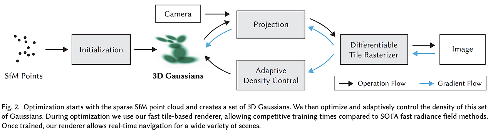
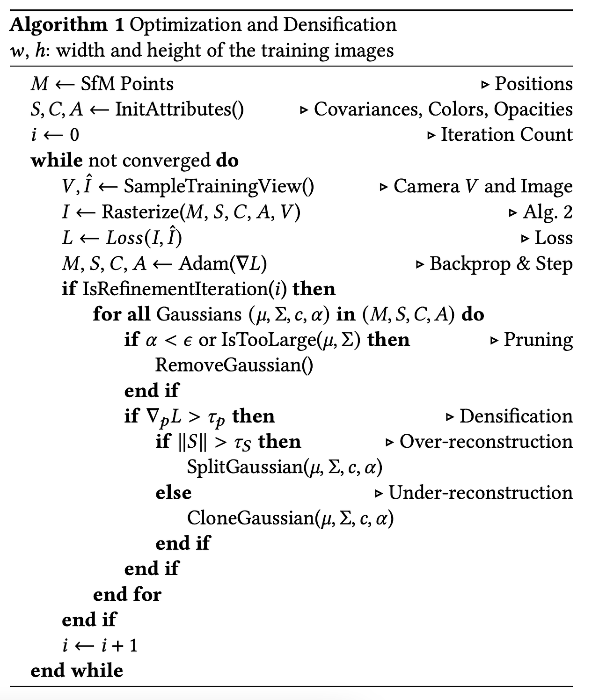
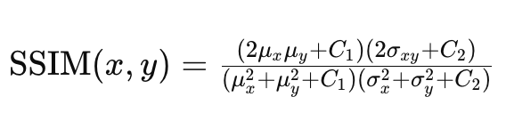
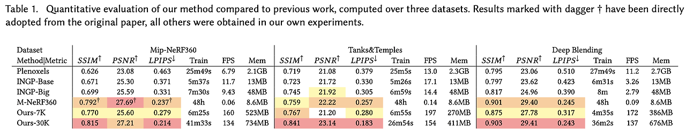
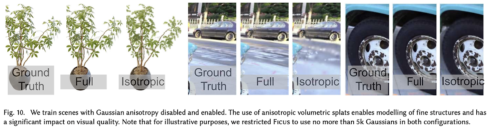

```{admonition} Information
- **Title:** 3D Gaussian Splatting for Real-Time Radiance Field Rendering

- **Reference**
    - Paper:  [https://arxiv.org/abs/2308.04079](https://arxiv.org/abs/2308.04079)
    - Project: [https://repo-sam.inria.fr/fungraph/3d-gaussian-splatting/](https://repo-sam.inria.fr/fungraph/3d-gaussian-splatting/)

- **Author:** Hyunsoo Kim

- **Last updated on June. 12, 2024**
```

# 3D Gaussian Splatting for Real-Time Radiance Field Rendering

NeRF 기반 방식들은 높은 품질의 새로운 장면 합성이 가능하지만, 시간이 많이 걸려 실시간 렌더링에는 한계가 있다. 다른 방식들은 시간은 빠르지만 품질이 떨어진다. 이를 해결하기 위해, 논문은 3D Gaussian Splatting을 제안합니다. 이 방법은 Mip-NeRF360과 유사한 성능을 제공하면서도 InstantNGP만큼 빠르게 학습할 수 있다.

3D Gaussian Splatting은 다음 세 가지로 구성된다다:

- Structure-from-Motion(SfM)에서 얻은 희소 점 구름을 초기값으로 3D 가우시안을 도입
- 3D 위치, 불투명도, 이방성 공분산, 구형 고조파(SH) 계수의 최적화
- 타일 기반 래스터화에서 영감을 받은 빠른 GPU 정렬 알고리즘을 통한 실시간 렌더링
  
이 방법은 이전의 implicit radiance field 접근법들과 동등하거나 더 나은 품질을 제공하며, 이전의 가장 빠른 방식과 유사한 학습 속도와 품질을 보여주어 고수준의 새로운 뷰 합성에 대해 처음으로 실시간 렌더링을 제공한다.
    

    
## Overview
:::{figure-md} 


Main process of 3D Gaussian Splatting
:::

:::{figure-md} 

Peusdo Algorithm of 3D Gaussian Splatting 
:::


    

<br>
  ## Differentiable 3D Gaussian Splatting

  이 논문은 normal(표면 법선)이 없는 Structure-from-Motion(SfM) 포인트들의 sparse한 셋을 initial point로 하여, 고품질의 novel view synthesis를 가능하게 하는 scene representation을 최적화하는 것을 목표로 한다. 

  빠른 렌더링을 위해 unstructured하고 explicit한 primitive를 필요로 하며, 이를 위해 미분 가능하고 2D splats로 쉽게 project되는 3D Gaussian을 선택했다.

<br>
  :::{figure-md} 
  
  :::

  3D Gaussian은 포인트(mean) μ를 중심으로 하고, 3D 공분산 행렬 Σ로 정의한다. 렌더링을 위해 3D Gaussian을 2D로 project해야 하며, 이는 viewing transformation W에 따라 카메라 좌표계에서의 공분산 행렬 Σ'로 나타낼 수 있다. 최적화를 위해, Σ는 positive semi-definite 행렬이어야 하며, 이 때문에 최적화가 어렵다고 한다.
  <br>
    :::{figure-md} 
    
    :::

  따라서 논문에서는 더 직관적이고 최적화에 적합한 representation을 선택한다. 3D Gaussian의 공분산 행렬 Σ는 타원체의 구성을 설명하는 것과 유사하며, 이를 위해 scaling matrix S와 rotation matrix R을 사용한다. 

  scaling은 3D vector s로, rotation은 quaternion q로 표현하며, 이들은 각각의 행렬로 변환될 수 있다. 학습 동안 Auto grad(자동 미분)의 오버헤드를 피하기 위해 모든 파라미터에 대한 gradient를 명시적으로 유도한다.
  <br>
    :::{figure-md} 
    
    :::

  최적화에 적합한 anisotropic covariance representation은 장면의 다양한 geometry에 적응하도록 3D Gaussian을 최적화한다.

    

<br>
  ## Optimization with Adaptive Density Control of 3D Gaussians

  - **Optimization**
  - **Adaptive Control of Gaussians**
      
  이 논문의 핵심 접근법은 free-view synthesis를 위해 장면을 정확하게 표현하는 3D Gaussian의 밀집된 세트를 만드는 최적화 단계다. 여기에는 position 𝑝, 투명도 𝛼, 공분산 Σ뿐만 아니라, scene의 view-dependent appearance를 정확하게 위한 각 Gaussian의 색상 c를 표현하는 SH coefficients까지 포함된다.

<br>
  ## Optimization
  - 3D를 2D로 project할 때 발생할 수 있는 모호함을 피하기 위해, optimization 과정에서 geometry가 더 생성되거나, 삭제되거나 혹은 이동할 수 있어야 함
    - 공분산 파라미터의 퀄리티는 큰 homogeneous area들을 적은 수의 큰 anisotropic Gaussian들로 캡처될 수 있기 때문에 representation의 compactness에 중요

  - 논문은 SGD를 사용하고 일부 연산은 CUDA 커널을 사용합니다. 특히 빠른 rasterization은 최적화의 효율성에 중요합니다.
    - 이는 최적화의 주요 computation bottleneck이기 때문

  - 투명도 𝛼에 대해서는 sigmoid function을, 공분산의 scale에 대해서는 exponential activation 함수를 사용
    - initial 공분산 행렬은 가장 가까운 세 점까지의 거리의 평균을 축으로 하는 isotropic Gaussian으로 추정
    - position에 대해서만 exponential decay 스케줄링을 사용

  Loss function은 D-SSIM과 L1 loss를 사용하며, D-SSIM loss는 이미지의 왜곡(distortion)을 잘 반영하고 미분 가능하여 evaluation metric뿐만 아니라 loss로도 사용 가능.

  참고로 SSIM은 이미지의 밝기, 대조, 구조를 고려하여 두 이미지 간의 유사성을 측정하는 메트릭이다.

  <br>
    :::{figure-md} 
    
    :::

  <br>
    :::{figure-md} 
    
    :::

<br>
  ## Adaptive Control of Gaussians
  또한 Structure-from-Motion(SfM)으로 얻은 초기 희소 점들을 시작으로, scene을 더 잘 표현하기 위해 unit volume  내 Gaussian들의 수와 밀도를 점진적으로 최적화하는 방식을 제안한다.
  - 매 100번의 반복(iter)마다 Gaussian을 추가하고, 투명도 𝛼가 일정 값보다 작은 Gaussian을 제거

  Adaptive Control of Gaussians는 빈 공간을 채우고, missing geometric feature이 있는 region과 하나의 Gaussian이 너무 넓은 region을 커버하는 region에 집중합니다.

  이러한 지역은 모두 큰 view-space positional gradient를 가지며, 최적화를 통해 Gaussian을 이동시킵니다.
  - Under-reconstruction: 동일한 크기의 Gaussian을 복제하고 위치 기울기 방향으로 이동.
  - Over-reconstruction: Gaussian을 두 개로 나누고, 위치는 기존 Gaussian의 PDF를 샘플링해서 초기화.

  최적화 과정에서 입력 카메라에 가까운 Gaussian density의 부적절한 증가를 방지하기 위해, 3000번의 반복마다 투명도 α를 0에 가깝게 설정한다.
  <br>
    :::{figure-md} 
    
    :::
    
   
## Fast Diffenrentiable Rasterization for Gaussians
본 논문의 목표는 대략적인 α-blending을 가능하게 하고 이전 연구에 존재하던 gradient를 얻을 수 있는 splat들의 수에 대한 강한 제약을 피하는 빠른 전체적인 렌더링과 빠른 sorting을 가지는 것이다.

이러한 목표를 달성하기 위해 본 논문은 tile-based rasterization for Gaussian splats를 제안한다.

tile-based rasterization은 아래와 같은 흐름으로 진행된다.

- Screen을 16*16으로 나누고 view frustum과 각 타일에 대해 3D Gaussian들을 cull함
  - view frustum외에 있는 것들을 제거하는 절차
  - 16*16으로 나눈 이유는 각 타일마다 다른 GPU thread에서 계산해서 빠르게 계산하기 위함
- guard band를 이용해 극단적인 위치(너무 가깝거나 먼)에 있는 gaussian들 또한 제거
  - 이들의 projected 2D covariance를 계산하는 것은 불안정적
- 그런 뒤, gaussian들 마다 속한 tile과 depth에 따라 key를 부여
- 이를 GPU Radix sort를 이용해 정렬
- 각 타일마다 front-to-back으로 color와 α값을 accumulate해서 픽셀 값을 구함

<br>   
  ## Results and Evaluation
  <br>
    - Results and Evaluation
      데이터셋에 따라 결과는 다르지만 SOTA이상의 퀄리티를 내면서 좋은 Training time과 FPS를 보인다.
    <br>
      :::{figure-md} 
      
      :::

<br>
  <br>
    :::{figure-md} 
    
    :::
  <br>
  - Ablations
    <br>
      :::{figure-md}
      
      :::
    <br>
      :::{figure-md}
      
      :::

<br>
  ## Limitations
  - 이전의 방식들과 유사하게 잘 관측되지 않은 장면은 artifact들이 존재
  - 이전의 방식들과 유사하게 늘어지고 얼룩진 artifact를 생성할 수 있음
  - 최적화에서 거대한 Gaussian이 만들어지면 popping artifacts 가끔 발생
  - 최적화에서 regularization을 적용하지 않음
  - NeRF-based 기법들보다 memory consumption이 상당히 높음