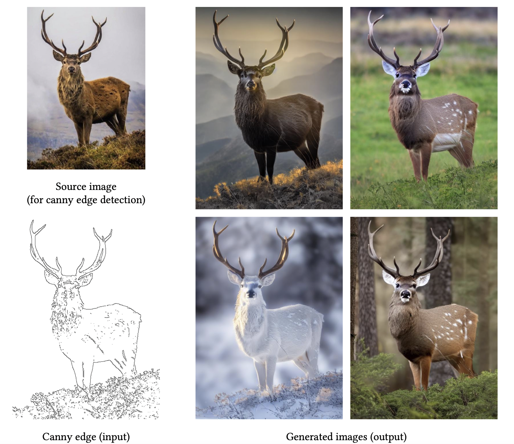
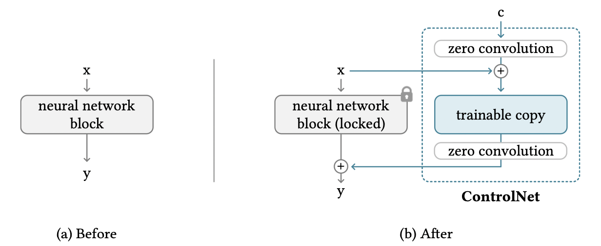
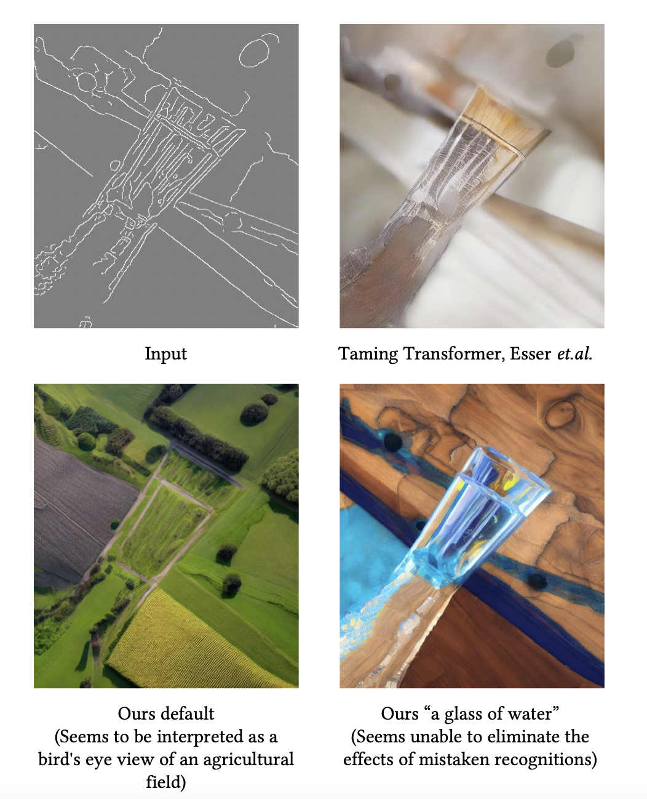

```{admonition} Information
- **Title:** Adding Conditional Control to Text-to-Image Diffusion Models (arxiv 2023)

- **Reference**
    - Paper: [https://arxiv.org/abs/2302.05543](https://arxiv.org/abs/2302.05543)
    - Code: [https://github.com/lllyasviel/ControlNet](https://github.com/lllyasviel/ControlNet)

- **Author:** Jisu Kim

- **Last updated on May. 28, 2023**
```

# ControlNet

## Additional Control with Image-based condition

기존의 Text-to-Image 모델들은 text prompt로 생성할 이미지의 특징을 조절할 수 있었습니다. 하지만 이런 prompt-based control만으로 이미지의 특징을 조절하는데 한계가 있었습니다. 이 논문에서는 image-based condition을 추가적으로 줘서 생성되는 이미지의 특징을 더 잘 조절하는 ControlNet이라는 신경망 구조를 제안합니다. 

아래 그림은 “a high quality, detailed, and professional image”라는 prompt와 왼쪽 아래의 Canny edge를 input으로 받아서 오른쪽의 이미지들을 생성한 것입니다. 이런 식으로 추가적인 image-based condition (아래 그림에서는 Canny edge)를 input으로 받아 이미지를 생성하는 것이 ControlNet이 하는 역할입니다.

:::{figure-md} 


Images generated by ConrolNet
:::

그러면 어떤 구조를 사용해서 이를 가능하게 했을까요? 이제부터 이에 대해 알아보도록 하겠습니다.

## ControlNet Block

ControlNet의 block 구조는 다음과 같은 두 가지 특징을 가집니다.

1. pretrained model의 locked copy와 trainable copy를 사용

2. zero convolution

:::{figure-md} 


ConrolNet block
:::

왜 이렇게 설계했는지 알아봅시다. 

우선, copy를 사용하는 이유는 기존에 방대한 양의 데이터로 학습시킨 pretrained model의 성능을 유지하기 위해서입니다. 또한, ControlNet의 학습 데이터가 양이 적은 경우에 오버피팅을 피할 수 있는 효과도 있을 것입니다.

zero convolution이란 weight랑 bias가 0으로 초기화한 1x1 convolution을 말합니다. zero convolution을 사용할 경우 훈련이 시작되기 전에는 input에 대해 pretrained model과 ControlNet의 output이 똑같아집니다. 따라서 기존 모델이랑 똑같은 input, output을 가지게되므로 기존 모델의 성능을 유지할 수 있으며, 추가적인 훈련이 fine tuning을 하는 것과 비슷하므로 scratch부터 학습하는 것에 비해 빠르게 훈련시킬 수 있게됩니다. 

그러면 zero convolution은 어떻게 이를 가능하게 하는지 좀 더 자세히 알아봅시다. 

## Zero Convolution

먼저 위의 그림에서 (a)에 해당하는 부분을 아래와 같이 수식으로 표현하겠습니다.

$$
\mathbf{y}=\mathcal{F}(\mathbf{x};\Theta)
$$

$\mathbf{x}$는 input feature map, $\mathcal{F}$는 neural network block, $\Theta$는 $\mathcal{F}$의 parameter, $\mathbf{y}$는 output을 의미합니다. 위 그림의 (b)를 수식으로 표현하기위해 $\mathcal{F}$의 trainable copy를 만들어서 parameter를 $\Theta_{c}$라고하고 $\Theta$는 고정시켜두겠습니다. 또한, zero convolution은 $\mathcal{Z}$로 표현하고 두 zero convolution의 parameter를 각각 $\Theta_{z1}, \Theta_{z2}$로 두겠습니다. 그러면 (b)에서 condition $\mathbf{c}$에 대한 output $\mathbf{y}_{c}$는 아래와 같이 표현할 수 있습니다.

$$
\mathbf{y}_{c}=\mathcal{F}(\mathbf{x};\Theta)+\mathcal{Z}(\mathcal{F}(\mathbf{x}+\mathcal{Z}(\mathbf{c};\Theta_{z1});\Theta_{c});\Theta_{z2})
$$

그런데 $\mathcal{Z}$의 weight와 bias의 초깃값이 0이므로 훈련이 진행되지 않았을 경우 $\mathbf{y}_{c}=\mathbf{y}$입니다. 따라서 훈련 시작 전에는 ControlNet과 기존 모델이 같은 결과를 내므로 기존 모델의 성능을 보존할 수 있습니다.

그런데 weight랑 bias가 전부 0으로 초기화되어있으면 gradient가 0이라서 훈련이 안 되는거 아닐까요? 이를 확인하기 위해 다음과 같이 간단한 경우를 생각해보죠.

$$
y=wx+b
$$

gradient는 다음과 같습니다.

$$
\frac{\partial y}{\partial w}=x,\; \frac{\partial y}{\partial x}=w,\; \frac{\partial y}{\partial b}=1 
$$

weight랑 bias가 0이고, $x\neq0$이라고 하면

$$
\frac{\partial y}{\partial w}\neq0,\; \frac{\partial y}{\partial x}=0,\; \frac{\partial y}{\partial b}\neq0 
$$

입니다. 따라서 첫 번째 gradient step에서 weight는 0이 아닌 값으로 가게되고, $\frac{\partial y}{\partial x}\neq0$이 되므로 훈련이 됩니다. 여기서 핵심적인 가정이 $x\neq0$인데 이 부분은 잘 훈련된 pretrained model을 사용하고 있기 때문에 위배될 가능성이 낮을 것입니다.

지금까지 얘기한 ControlNet block 구조를 pretrained Stable diffusion에 적용한 전체 구조는 아래 그림과 같습니다.

:::{figure-md} 


Overall structure
:::

## Training & Results

training loss는 기존 stable diffusion에서 image-based condition $\mathbf{c}_{f}$가 추가된 형태입니다.

:::{figure-md} 


Loss
:::

training을 할 때 50%의 확률로 prompt $\mathbf{c}_{t}$를 empty string으로 바꿔주었다고 합니다. 이는 prompt가 주어지지않을 경우 모델이 $\mathbf{c}_{f}$로부터 semantics를 더 배우는 경향이 있기 때문에 이미지 생성을 $\mathbf{c}_{f}$로 조절하는 능력을 향상시켜줄 수 있다고 합니다.

아래 결과는 training이 기존 방법보다 효율적이라는 것을 보여줍니다.

:::{figure-md} 


Efficiency
:::

아래 결과들은 task에 따른 결과들입니다. 더 많은 이미지들이 논문에 있으니 참고하시기 바랍니다.

:::{figure-md} 


Pose
:::

:::{figure-md} 


Images generated by ConrolNet
:::

아래는 논문에서 limitation이라고 언급한 이미지입니다. 텍스트로 추가적인 정보를 주었음에도 원하는 이미지가 생성되지 않는 경우가 발생했습니다.

:::{figure-md} 


Limitations
:::

## Implementation

코드는 공식 구현([링크](https://github.com/lllyasviel/ControlNet))에서 가져왔습니다. 아래 코드는 parameter를 0으로 초기화하는 코드로 zero convolution을 만들 때 사용됩니다.

```python
def zero_module(module):
    """
    Zero out the parameters of a module and return it.
    """
    for p in module.parameters():
        p.detach().zero_()
    return module
```

아래 코드는 기본적으로 nn.Sequential과 같은데 time step같은 추가적인 input을 받아줄 수 있게 만든 것입니다.

```python
class TimestepEmbedSequential(nn.Sequential, TimestepBlock):
    """
    A sequential module that passes timestep embeddings to the children that
    support it as an extra input.
    """

    def forward(self, x, emb, context=None):
        for layer in self:
            if isinstance(layer, TimestepBlock):
                x = layer(x, emb)
            elif isinstance(layer, SpatialTransformer):
                x = layer(x, context)
            else:
                x = layer(x)
        return x
```

아래 코드는 공식 github의 cldm/cldm.py에 있는 ControlNet class입니다. init 부분은 길어서 생략했습니다.

```python
class ControlNet(nn.Module):
    def __init__(...):
			...

		def make_zero_conv(self, channels):
        return TimestepEmbedSequential(zero_module(conv_nd(self.dims, channels, channels, 1, padding=0)))

    def forward(self, x, hint, timesteps, context, **kwargs):
        t_emb = timestep_embedding(timesteps, self.model_channels, repeat_only=False)
        emb = self.time_embed(t_emb)

        guided_hint = self.input_hint_block(hint, emb, context)

        outs = []

        h = x.type(self.dtype)
        for module, zero_conv in zip(self.input_blocks, self.zero_convs):
            if guided_hint is not None:
                h = module(h, emb, context)
                h += guided_hint
                guided_hint = None
            else:
                h = module(h, emb, context)
            outs.append(zero_conv(h, emb, context))

        h = self.middle_block(h, emb, context)
        outs.append(self.middle_block_out(h, emb, context))

        return outs
```
