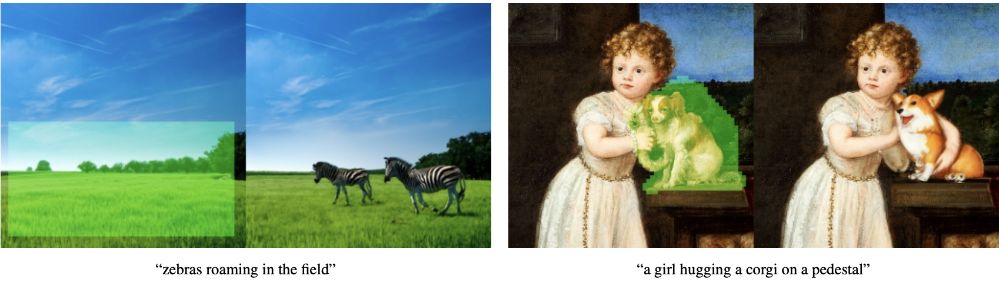
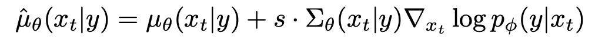
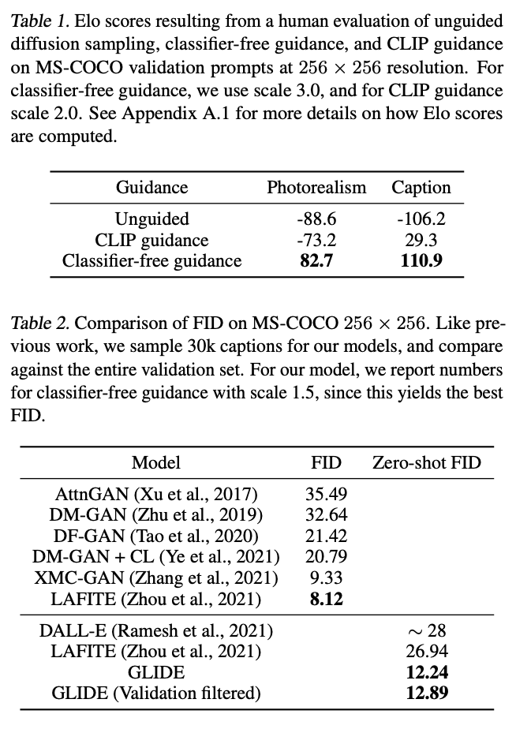

``` {admonition} Information
- **Title:** GLIDE: Towards Photorealistic Image Generation and Editing with Text-Guided Diffusion Models (ICML 2022)

- **Reference**
    - Paper: [https://arxiv.org/abs/2112.10741](https://arxiv.org/abs/2112.10741)
    
- **Author:** Sehwan Park

- **Last updated on Oct. 20, 2023**
```


# GLIDE

## Abstract

* GLIDE 기법이 DALL-E보다 human-evaluator 평가가 더 우수하다고 한다.

* classifier-free Guidance vs CLIP-Guidance(classifier-free Guidance를 결국 사용.)

* powerful한 text-driven image editing이 가능.

  

## 1. Introduction

 Natural language로 부터 realistic한 image를 만드는 많은 방법들이 생겨나고 있다. 하지만 text prompts에 정확히 대응하는 photorealistic한 image를 생성하기에는 어려움을 겪고 있다.

 Diffusion model이 DDPM, DDIM 논문을 통해 생성모델의 중심으로 떠오르며 unconditional한 image에 대해서는 SOTA를 찍었다고 한다. 자연스럽게 class-conditional한 image 생성에 대해서도 연구가 이루어졌는데, Diffusion models beat gans on image synthesis라는 논문에서 저자들은 noise한 image에 대해 class를 예측하는 classifier를 추가하여 sampling과정에서 label에 해당하는 이미지를 생성하도록 gradient를 control시키는 classifier guidance 방법을 소개한다. 이후, classifier없이 guidance를 줄 수 있는 classifier-free guidance 방법이 소개되었다. 

이 논문에서는 classifier-free guidance 방법과 기존 diffusion model을 활용하여 text-conditional image synthesis를 잘 수행했다고 보여준다. 추가적으로  pretrained CLIP 모델을 활용하여 CLIP guidance라는 방법을 제시하며 classifier-free guidance와 비교를 한다. 결과적으로는 classifier-free guidance가 더 좋은 성능을 보인다고 한다.

text prompt를 zero-shot으로 생성하는데에 있어 좋은 성능을 보였으나, 복잡한 prompt에 대한 photorealistc한 image를 생성하는데는 어려움을 겪을 수 있다고 한다. 그래서 이 논문에서는 text-conditional image generation뿐만 아니라 기존 image를 text-prompt를 통해 편집할 수 있는 image impainting기능도 가능하도록 했다고 한다.

:::{figure-md}


GLIDE text to image
:::

:::{figure-md}



GLIDE image impainting
:::

## 2. Background

### 2.1 Diffusion Models

* DDPM

DDPM에서는 임의의 time step t로 부터 noise가 껴있는 image $x_t$의 $\epsilon_t$가 얼만큼인지 예측한다. 예측한 $\epsilon_t$를 이용하여 noise가 일부 제거된 이전 step의 mean($\mu_{\theta}(x_t)$)을 구할 수 있고 variance($\sum_{\theta}(x_t)$)는 constant한 값으로 고정시킨다. DDPM에서 제시한 forward process와 reverse process는 다음과 같다.

$$
q(x_t|x_{t-1}) = \mathcal{N}(x_t; \sqrt{\alpha_{t}}x_{t-1}, (1-\alpha_t)\mathcal{I})
$$ 
$$ 
p_{\theta}(x_{t-1}|x_t) := \mathcal{N}(\mu_{\theta}(x_t), \sum_{\theta}(x_t))
$$

* Score-based generative modeling through stochastic differential equations

해당 논문에서는 결국 score를 구하는 것과 epsilon을 구하는 것이 결국 같은 방향성을 띤다라고 주장한다.

:::{figure-md}


Proof of proportional relationship to finding score and epsilon
:::

* Improved-DDPM

$\sum_{\theta}$를 constant값으로 고정시킨 이전 DDPM과 달리 해당 논문에서는 $\sum_{\theta}$ learnable parameter로 설정하여 더 적은 diffusion step만으로 더 좋은 quality의 sample을 만들어낼 수 있다고 제시한다.

### 2.2 Guided Diffusion

Diffusion model beat GANS on Image Synthesis(Dharwial et al.)에서는 diffusion model을 통해 class-conditional한 image생성을 제시한다. 이 논문에서의 가장 핵심적인 기술이 classifier-guidance이다. noise한 image로부터 epsilon을 예측하는 model은 그대로 유지하되, 해당 noise image가 어떤 class에 속하는지 분류하는 별도의 classifier를 설정한다. 이 classifier의 score를 통해 class-conditional한 전체 과정의 score에게 guide를 주는 방법을 제시한다.

:::{figure-md}


Classifier guidance
:::

:::{figure-md}



Classifier guidance
:::

### 2.3 Classifier-free guidance

classifier를 통해 class-conditional한 image생성을 하는 방법이 위에 소개되었는데, 이 방법은 noise한 image에 대해서 classifiy를 해야하므로 pretrained model을 사용할 수 없고 모델 규모가 너무 heavy해지는 등 몇몇 문제점을 가지고 있었다. 이 방법에 대한 개선점을 Classifier-Free Diffusion Guidance(Ho et al.)에서 Classifer-free guidance라는 기법으로 제시한다. 위의 score 식에서 약간의 변형을 통해 classifier 없이 단일 model만으로 guidance를 줄 수 있는 방법을 제시한다.

:::{figure-md}


Classifier-free guidance
:::

### 2.4 CLIP guidance

CLIP은 텍스트와 이미지 사이의 joint representation을 학습할 수 있는 모델이다. Image encoder f(x)와 Text encoder g(c)로 이루어져 있다. (x,c) 즉 이미지와 이미지 캡션 쌍으로 이루어진 대규모 데이터를 이용해 contrastive learning을 진행시킨 모델이다. 같은 의미를 가진 positive pair에 대해서는 f(x) · g(c)(유사도)가 커지도록 negative pair에 대해서는 f(x) · g(c)가 작아지도록 하는 것이다. CLIP guidance에서는 classifier guidance에서 classifier대신에 pretrained CLIP모델을 사용한다. 따라서 guidance를 주는 방식도 classifier대신 CLIP모델을 통해 구한 noise한 image x와 주어진 text간의 유사도를 이용한다. 

:::{figure-md}


CLIP
:::

:::{figure-md}


CLIP guidance
:::

## 3. Training

실험에서 3.5 billion parameter의 text-conditional diffusion model을 64x64 resolution을 위해 사용했고 또다른 1.5 billion parameter의 text-conditional upsampling diffusion model을 256x256으로 resolution을 증가시키는데 사용하였다고 한다. 또한, CLIP guidance를 위해 noised 64x64 ViT-L CLIP model을 사용했다고 한다.

### 3.1 Text-Conditional Diffusion Models

Improved DDPM의 ADM model을 base로 text-conditioning을 추가하여 학습을 진행하였다. 주어진 noised image $x_t$로부터 $x_{t-1}$을 예측하는 $p_{\theta}(x_{t-1}|x_t,c)$를 수행해야한다. text를 condition으로 주기 위해서 우선 주어진 text를 K개의 token으로 encoding한 후, Transformer model에 input값으로 넣어준다. Transformer output의 마지막 embedding token과 positional encoding을 통해 나온 time step embedding token을 연산하고자 하는 크기에 맞게 linear projection하여 더한 후, residual block을 거친 image와 AdaIN기법을 통해 residual block의 output을 도출한다. Transformer output의 마지막 layer는 연산하고자 하는 크기에 맞게 linear projection하여 residual block뒤에 붙는 attention block에 이용한다.

학습 데이터셋은 DALL-E와 같은 데이터셋을 사용하였고 model architecture로는 기존  ADM model보다 더 scale up된 model과 1.2B paremeters를 갖는 Transformer를 사용했다고 한다. 게다가 64x64 image를 256x256 image로 upsampling하는 Upsampler model도 학습시켰다고 한다. upsampler model은 Improved DDPM에서의 ImageNet Upsampler와 거의 비슷하다고 한다.

### 3.2. Fine-tuning for classifier-free guidance

처음 training을 진행했을때는, text를 condition으로 준 conditional image generation에 맞춰 training을 진행했다고 한다. 이 후, unconditional image generation의 성능을 위해 데이터셋의 약 20%의 text condition에 empty sequence를 주고 training을 진행했다고 한다.

### 3.3. Image Inpainting

이전 연구에서는, impainting을 위해 diffusion model로 학습시키는 과정을 거치지 않았다. diffusion model로 sampling을 한 후, 알려진 영역에 대해서는 $q(x_t|x_0)$로 대체하는 방식을 사용했기에 model이 sampling을 하는 과정에서 전체 context를 참조할 수 없다는 단점이 있었다.

이 논문에서는 fine-tuning과정에서 training example의 임의의 부분을 지운다음, 남은 부분은 모델에 추가적인 조건 정보로서 마스크 채널과 함께 입력되도록 설계하였다. 

### 3.4. Noised CLIP models

classifier guidance에 더 적합하게 훈련시키기 위해 clip guidance를 사용해서 classifier-free guidance와 비교했음을 위에서 언급했다. clip guidance를 사용하기 위해 저자들은 noise image에 대해 학습시킨 Noised CLIP models를 사용했음을 밝힌다. 위에서 언급했듯이 결과는 classifier-free guidance가 더 좋았다고 한다.

:::{figure-md}


comparison between CLIP guidance and classifier-free guidance
:::

## 4. Results

:::{figure-md}


Quantitive Results
:::

논문에서는 classifier-free guidance와 CLIP guidance에 대해 Precision과 Recall, FID와 IS, CLIP score와 FID 간의 명확한 trade-off 를 관찰하고 있다고 언급한다. 

위의 (a)와 (b)에 대해서는 classifier-free guidance가 거의 최적으로 수행되었으며, classifier-free guidance가 훨씬 강력한 방법임을 보여주고 있다. 반면, (c)에서는 CLIP guidance가 CLIP 점수를 classifier-free guidance에 비해 상당히 향상시킬 수 있는 것으로 보인다. 저자들은 CLIP guidance가 주로 CLIP 모델의 평가에 따라 이미지를 생성하는 데 중점을 둘 수 있지만, 특정 prompt 또는 caption과 일치시키는 데 뛰어나지 않을 수 있다는 가설을 제시한다. 이 가설을 확인하기 위해 저자들은 인간 평가자를 활용한 실험을 진행하였고 인간들이 CLIP 점수와 다른 의견을 가지며, classifier-free guida  nce가 해당 prompt와 더 일치하는 더 높은 품질의 샘플을 생성한다고 판단했다. 

:::{figure-md}



Zero-shot FID results
:::

Table1은 Unguided, CLIP guidance, Classifier-free guidance 기법을 각각 적용한 256x256 resolution image에 대해 human evaluation을 진행한 결과이다. Classifier-free guidance를 적용한 결과가 photorealism, caption 항목에 대해 압도적인 결과를 보임을 알 수 있다.

Table2는 GLIDE와 다른 text-conditional image generation model들을 비교한 표이다. MS-COCO dataset에 대해 생성된 image의 FID score를 구하였다. GLIDE model이 MS-COCO에 대해 학습한 경험이 없음에도 불구하고 Zero-shot FID 부분을 보면 상당히 좋은 result를 보임을 알 수 있다.

:::{figure-md}


final results
:::
