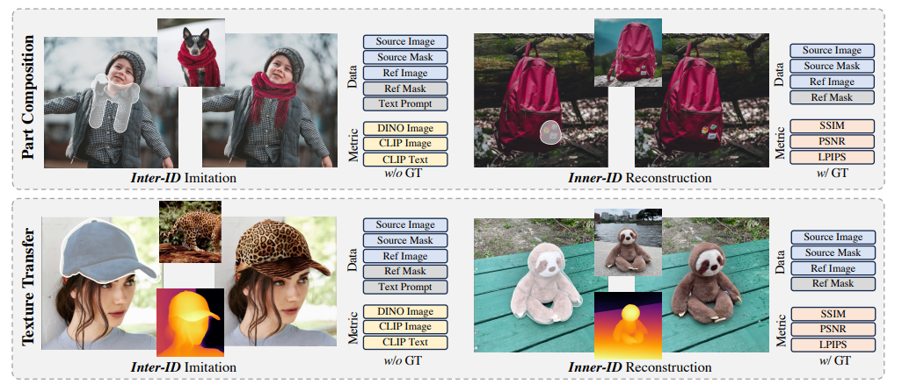
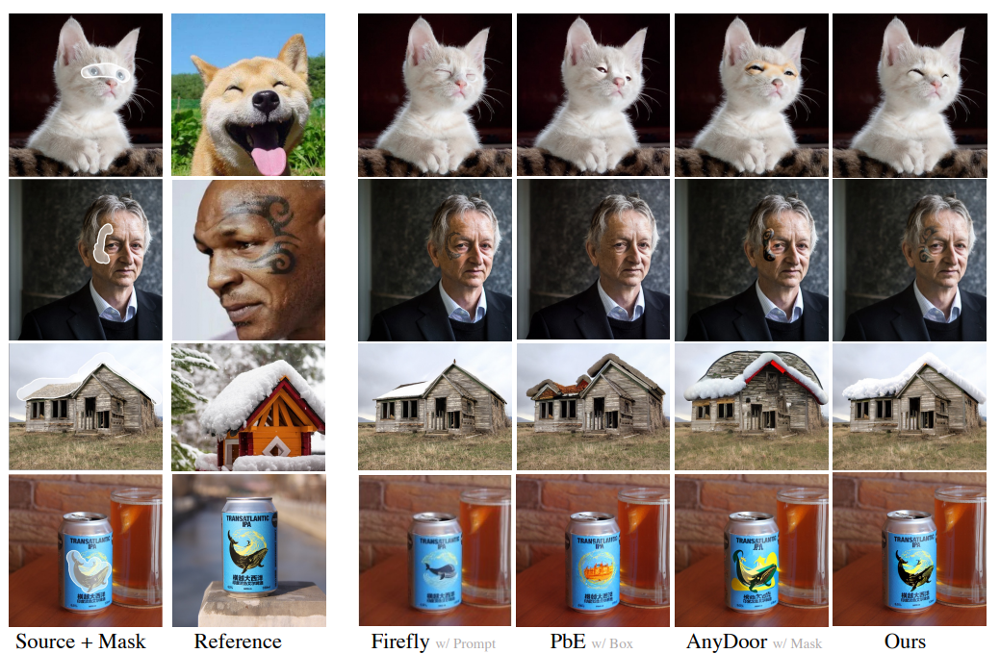
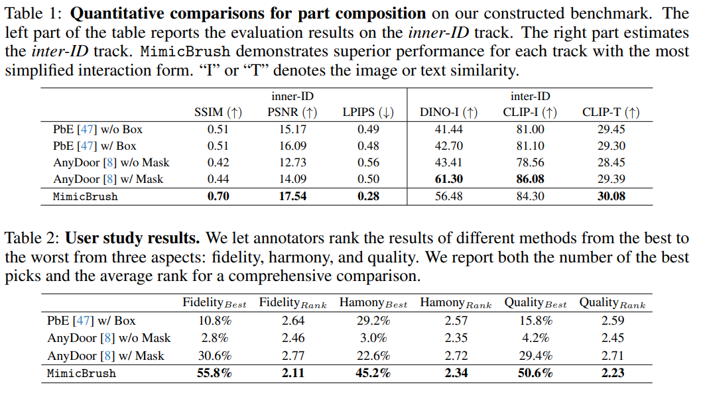
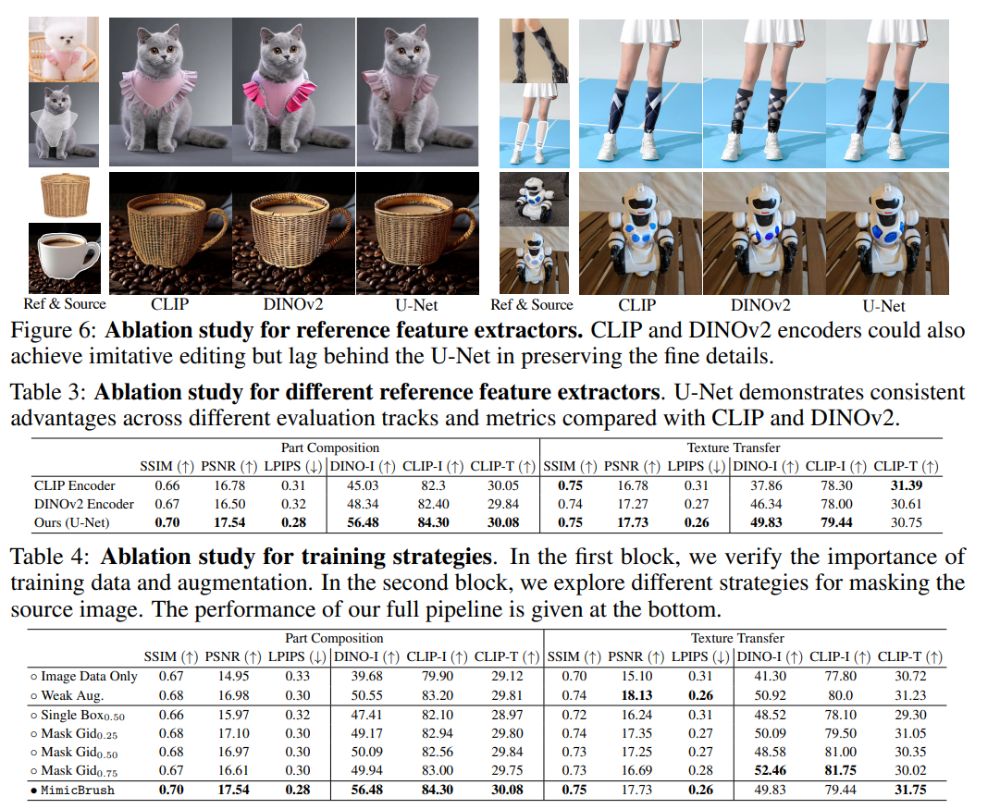
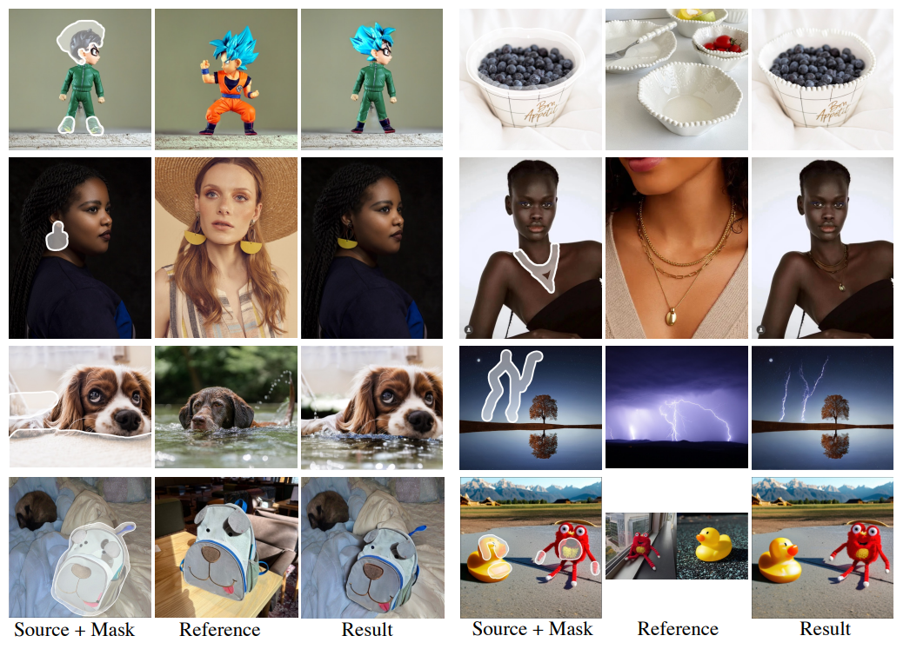

```{admonition} Information
- **Title:** MimicBrush: Zero-shot Image Editing with Reference Imitation

- **Reference**
    - Paper: [https://arxiv.org/pdf/2406.07547](https://arxiv.org/pdf/2406.07547)
    - Code: [Official](https://github.com/ali-vilab/MimicBrush)
    
- **Author:** Chanyeong Shin

- **Last updated on Nov. 05, 2024**
```

# MimicBrush: Zero-shot Image Editing with Reference Imitation 

## Three Lines Summary

1. Edited Image 로 어떻게 자연스럽게 변해야 할지에 관한 **“imitative editing” 에 관한 아이디어**
2. **Source Image 와 Reference Image 간의 correspondence** 를 이용해 바뀌어야 할 부분을 잘 가져오는 방법인 MimicBrush 라고 명명한 generative training framework 제안
3. **SOTA 인 동시에 앞으로의 imitative editing 연구를 위한 evaluation benchmark** 제안

## 1. Introduction

- Image editing 분야 자체가 굉장히 수많은 요구 조건과 시나리오를 만족하면서 수행되어야 했기에 기존의 방법들이 여전히 challenging 한 문제를 풀고 있음
- 기존의 방법들은 현재 source image 와 함께 해당 mask 를 input 으로 넣어주고 있음 (이건 공통)
    - Inpainting method
        - editing 이라는 task 를 **“Text Prompt”** 하나로만 해결하고자 했는데 이건 원하는 결과를 뽑아내기에는 적절하지 않음
        - My thoughts : 실제로 inpainting 은 refining 과 같이 자연스럽게 만들어주는 것 외에는 실무에서 잘 사용하지는 않았던 것 같음
    - Composition method
        - ref image 와 ref mask/box 를 이용해 이를 해결하고자 하였는데, 아무래도 **“individual object” 를 insertion** 하는 작업처럼 느껴 모델이 어려워 할 만 했음
            - shoe soles 이나 hair 와 같은 local components 나 로고나 texture 같은 local patterns
        - 또한, Image 로부터 reference area 를 완벽하게 잘 추출하는 방법이 필요했음
        - Local components 들은 또 전체 image 에 잘 어우러지게 하는 것도 고려해야 했고, 학습 과정에서 같은 object 인데 frame 에 따라 모양도 조금씩 달라서 이런 다양한 문제들을 풀어야 했음
- 앞선 문제들을 해결하기 위해서, editing 을 할 수 있는 novel pipeline 인 **imitative editing** 을 제안
    - Ref image 에서 mask 는 사용하지 않고 source image 의 mask area 부분을 ref image 에서 어디에 해당하는지 자동으로 찾고 모방할 수 있도록 하였음

- Imitative editing 을 하기 위해서 **MimicBrush 라고 하는 dual diffusion U-Nets network framework** 를 제안
    - self-supervised manner 로 학습함 → 같은 video 에서 source / ref image 를 뽑아서 학습에 활용하는 방식
    - 당연히 같은 video 에서 추출했기 때문에 semantic correspondence 와 visual variations 를 가지고 있을 것
    - masked source image 는 imitative U-Net 으로 / reference image 는 reference U-Net 으로 통과 → 이후  reference U-Net 의 attention K,V 를 imitative U-Net 에 injection 시키는 방식
- 이 Image editing 방식을 이용하여 학습된 model 은 구도, 조명, 카테고리 자체가 달라도 잘 변환이 되는 결과를 보였으며, ref image 의 visual concepts 의 detail 도 잘 유지한 채로 가져오는 것을 확인하였음
- 조금 더 comprehensive 한 evaluation 을 위해서 imitative editing 의 benchmark 까지 제안
    - part composition : 얼마나 part 구성이 자연스럽게 잘 되었는가?
    - texture transfer : 느낌을 얼마나 잘 유지하면서 texture 가 변환됐는가?

## 2. Method

:::{figure-md} 


The training process of MimicBrush
:::

### Overall Pipeline

- **Dual diffusion models architecture + self-supervised manner**
- Video data 에는 consistent content 를 가지고 있고 visual variations 까지 있기 때문에 이를 활용
    - 랜덤하게 video clip 에서 two frames 를 뽑아서 학습 sample 로 활용
- source image 는 masking 시키고, ref image 는 masked source image 를 recover 할 수 있도록 도움을 주도록 넣음
- 결국 MimicBrush 는 dog’s face 와 같은 corresponding visual information 이 위치하는 것을 학습하고 source image 의 masked area 를 repaint 시킴
- 또한 source image 의 빈 부분을 채우는 과정에서 자연스럽게 blending 시켜야 하기 때문에 visual content 를 같은 환경의 포즈, 조명, 시점으로 변환하는 것도 학습

- 앞서 언급했던 것처럼 dual branch 의 U-Nets 구조를 활용 → imitative and reference U-Net
    - attention layers 의 K,V 는 서로 share 하고(실질적으로는 concat) reference image 로부터 indications 을 찾아 masked source image 를 만들도록 함
- 추가로, source & ref image 에 variation 을 증가시키기 위해 augmentation 도 적용
- 또한, optional condition 으로 imitative U-Net 에 depth map 도 줌
    - inference 단계에서 object 의 shape 가 잘 유지됐는지 depth map 을 활용할지 말지를 결정할 수도 있게 하였음


### Model Structure

- Imitative U-Net
    - Base : SD-1.5 inpainting model
    - Input : 13 channels tensor
        - image latent → 4 channels
        - binary mask → 1 channel
        - background latent → 4 channels
        - depth latent → 4 channels
    - (Figure 에는 나와있지 않지만) 기존 original U-Net 은 CLIP 을 text embedding 으로 활용하는데, 본 논문은 CLIP 을 reference image 으로부터 뽑아낸 image embedding 을 cross-attention 에 활용
        - image embedding 이후에 projection layer 을 거쳐 들어감
    - 학습은 imitative U-Net 과 CLIP projection layer 의 parameters 들이 학습..

- Reference U-Net
    - 최근에 굉장히 많은 연구들이 reference image 로부터 fine-grained features 를 뽑아내기 위해 additional U-Net 을 활용하는 것이 훨씬 더 효율적이라는 것을 증명하였음
    - Base : SD-1.5
    - reference features 를 imitative U-Net 의 middle & upper stages 에 K,V 를 injection (concat) 시킴
        - 이를 통해, imitative U-Net 이 reference image 의 content 를 활용해 source image 의 masking 된 부분을 완성시킴

- Depth Model
    - Depth Anything 으로 unmasked source image 의 depth map 을 뽑도록 했음
    - Depth model 자체는 freeze 시키고, trainable projector 를 넣어 depth map 을 depth latent 인 4-channel 로 projection 시킬 수 있도록 함
    - 학습 중에는 depth model 의 input 을 0.5 확률로 drop 시킴으로써 inference 중에 optional 하게 shape control 을 가능하도록 함
        - My thoughts : 아마 texture transfer task 를 위함 일듯

### Training Strategy

- MimicBrush 의 cross-image imitation ability (서로 다른 카테고리에서 잘 모방해오는 능력 정도로 이해하면 됨) 를 끌어올리기 위해서는 조금 더 적합한 training sample 을 모아서 학습할 수 있는 방법이 필요했음
- Training data 를 구축하는 과정에서 두 가지의 철학을 지키려 하였음
    1. source / reference images 들 간의 correspondence relation 이 존재해야 한다.
    2. robustness 를 위해 source / reference image 사이의 large variations 을 기대할 수 있어야 한다.
- Data selection
    - 학습 중에는 같은 비디오로부터 frame 2개를 sampling 해서 뽑았음
    - SSIM 을 이용해 video frames 간의 similarity 를 측정했고 너무 그 값이 크거나 작으면 filtering 했음
- Data augmentation
    - source & reference image 의 variation 을 증가시키기 위해서, 강력한 data augmentation 을 활용
        - color jitter, rotation, resizing, flipping, 심지어는 random projection transformation 으로 더욱 강한 deformation 도 수행
- Masking strategy
    - 가장 간단하게는 image 를 N x N grid 로 나누고 랜덤하게 masking 시키는 방법인데 저자들은 이렇게 랜덤하게 가져가면 easy cases 들이 많은 portion 을 차지한다는 것을 발견
        - ex. 배경 같은 큰 area 를 차지하는 것들은 계속 반복되는 content/textures 이기 때문에 도움이 안됨
    - SIFT matching 을 이용해서 source & ref image 의 matching points 를 얻고 그 matched feature points 의 grids 들을 좀 더 masking 하도록 하였음
    - video 보다 high-quality image 를 찾는 것이 더 쉬웠기 때문에 static image 한 장을 가지고 augmentation 시킨 다음, seg map 가지고 masking 시키는 방식으로도 활용 → robustness 를 증가시키는 효과를 불러일으킴

### Evaluation Benchmark

:::{figure-md} 


Evaluation Benchmark
:::

- Imitative editing 은 굉장히 novel 한 task 이기 때문에 본 논문에서 성능을 evaluation 할 수 있는 benchmark 까지 제공
- Part composition
    - source / ref image 간의 semantic correspondence 를 찾고 composition 시키는 task
    - Inter-ID track
        - Fashion, animal, product, scenario 등 다양한 data 를 각 topic 마다 30 장씩 모았음
        - 수동으로 source mask 를 다 그리고, 생성된 결과 GT 도 없기 때문에 직접 reference regions 과 text prompt 까지 다 annotation 시킴 = 노가다 했음
        - reference region 과 생성된 region 사이의 similarity 도 DINO 와 CLIP image sim score 를 계산하도록 했고 edited image 와 text prompt 사이의 CLIP text similarity 도 report 해놓음
    - Inner-ID track
        - DreamBooth 로부터 30 image paris 가져와서 source image masking 다 함
        - GT 와는 SSIM, PSNR, LPIPS score 활용
- Texture transfer
    - ref image 의 texture 나 pattern 을 얼마나 잘 transfer 했는지에 관한 task
    - Additional condition 으로 depth map 을 활용
    - Part composition 은 semantic correspondence 를 찾도록 하지만, 이 task 는 source shape 는 유지하면서 reference 의 texture 를 얼마나 잘 가져오는지를 판단하도록 objects 전체를 masking


## Experiments

### Implementation Details

- Hyperparameters
    - 512x512 image 로 resolution 다 맞추도록 해서 학습
    - Adam optimizer & lr : 1e-5
    - grid number N : 3~10 에서 randomly choose
    - masking 은 SIFT-matched features points 는 75% 고르도록 하고, 나머지는 50% 고르도록 하였음
    - Reference U-Net 에는 CFG 10% 확률로 drop 하도록 하였고, inference 시에 guidance scale 은 5
- Training data
    - Pexels 같은 websites 에서 100k video
    - diversity 증가시키기 위해서 SAM dataset 도 활용 → 여기서 static image augmentation 적용
    - 학습 중에는 Pexels 70% , SAM 30%

### Comparisons with Other Works

:::{figure-md} 


Qualitative Result
:::

:::{figure-md} 


Quantitative Result
:::

### Ablation Studies

:::{figure-md} 


Ablation Studies
:::

### Qualitative Analysis

:::{figure-md} 


Qualitative Analysis
:::

## Limitations

- Robust performance.. But, region 이 너무 작거나 multiple candidates 가 있게 되면 실패하는 경우가 생기긴 했음
    - 이럴 때는 zoom in 을 해서 하는 것을 추천한다고 함
- 여전히 유해한 content 들을 editing 하는 경우도 있기 때문에 이를 필터링 할 수 있는 방법이 고안되어야 한다고 주장

## Review

<aside>
🔖

**Three Line Review**

1. 논문 자체의 색깔이 역시 실무에 적합한 페이퍼다 !
2. Evaluation benchmark 까지 제안하면서 새로운 field 를 열려고 하는 시도가 인상 깊었다
3. paper 자체는 24.06 으로 따끈따끈한데 왜 SD 1.5 썼는지 이해가 잘 안 됐던.. 다른 baseline 도 써봤으면 더 좋았을 것 같다

</aside>
