```{admonition} Information
- **Title:** ProlificDreamer: High-Fidelity and Diverse Text-to-3D Generation with Variational Score Distillation (NeurIPS 2023 Spotlight)

- **Reference**
    - Paper: [https://arxiv.org/abs/2305.16213](https://arxiv.org/abs/2305.16213)
    - Code: [https://github.com/thu-ml/prolificdreamer?tab=readme-ov-file](https://github.com/thu-ml/prolificdreamer?tab=readme-ov-file)

- **Author:** Kyeongmin Yu

- **Last updated on Dec. 26, 2024**
```


# ProlificDreamer

- view generation이 가능한 DM의 특성을 3D rendering 모델로 전달하여 pretrained 된 DM이 생성하는 이미지 분포와 3D representaiton의 분포를 맞춰가는 것으로 Dream Fusion(SDS)과 유사하지만 개선된 아이디어(VSD)를 제안하고자한 논문이다.

:::{figure-md}
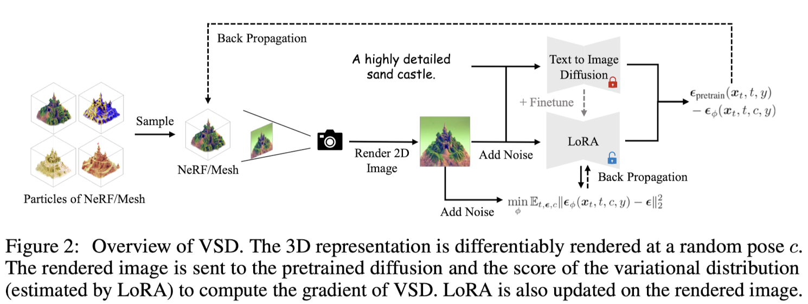

Prolific Dreamer Overview
:::

📌  **Prolific Dreamer 2-stage approach**

1. optimize a high-resolution NeRF by **VSD**
2. geometry optimization of mesh from NeRF with **SDS** (optional)

appendix를 참고하면, triangle 크기가 비교적 클때 VSD와 SDS의 차이가 크지 않으므로 SDS를 사용했다고 하며, 더 섬세한 mesh의 경우 VSD가 SDS에 비해 표현력이 좋을것으로 믿는다고 함.


:::{figure-md}
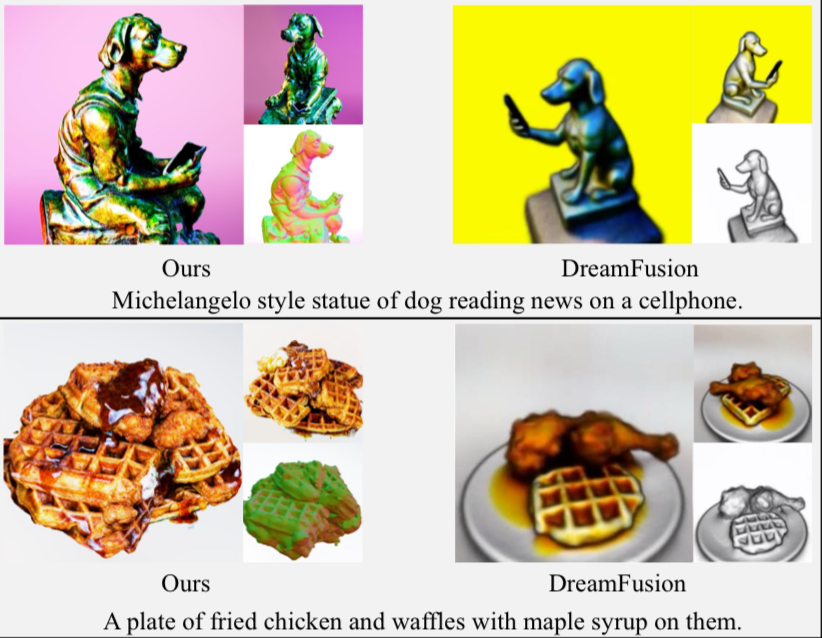

ProlificDreamer vs. DreamFusion 정성적 결과
:::

:::{figure-md}
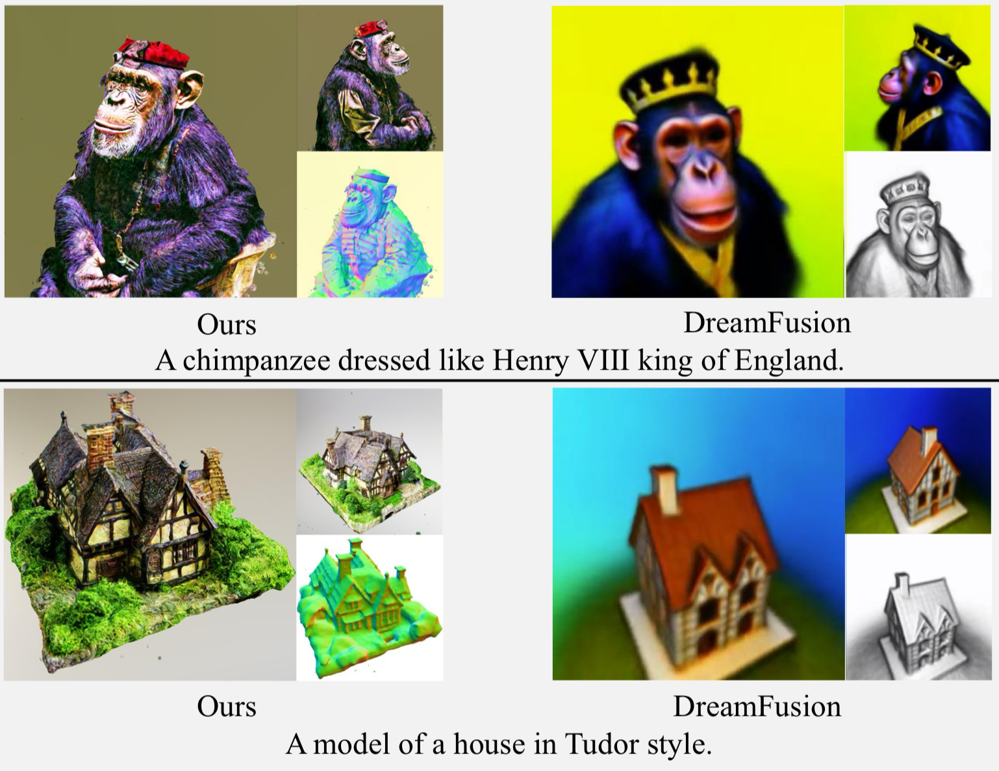

ProlificDreamer vs. DreamFusion 정성적 결과 
:::


## 1. Introduction

고품질의 3D content를 생산하는 것은 품이 많이 드는 일이다. 이러한 어려움을 해결하기 위해 text-to-3D 방식이 발전하고 있다. texture 기술을 기반으로 3D content 생성을 자동화하는 방식은 유망하며 다양한 분야(encompassing architecture, animation, gaming, AR/VR)  paradigm의 변화를 일으킬 수 있을 것이다. 

Diffusion model의 text-to-image 생성력을 바탕으로 3D content를 생성하려는 DreamFusion과 같은 시도가 있었다. Dream Fusion은  **Score Distillation Sampling(SDS)** 알고리즘을 이용해 단일 3D representation을 최적화 했다. 이는 어떤 방향에서 렌더링된 이미지라도 주어진 text에 대해 높은 likelihood를 갖도록 한것으로써 diffusion model에 의해 evaluate되었다. (diffusion model을 loss에 활용) 하지만 over-satuation, over-smoothing, low-diversity 문제가 발생했다. 또한 text-to-3D의 design space에서 orthogonal 한 요소(rendering resolution - distillation time schedule)들에 대한 파악이 아직 부족하다. 

본 논문에서는 섬세한 3D representation을 얻기 위해 이러한 모든 요소에 대해 systematic study를 진행한다. 먼저 **Variational Score Distillation(VSD)** 를 제안한다. 이는 주어진 textual prompt와 해당 3D scene을 하나의 random variable로 취급하며 하나의 점(single point)로 취급한 SDS와는 다르다. VSD는 3D scene의 분포를 최적화하며 이러한 분포는 모든 시점에 대해 rendered images의 분포가 서로 최대한 가까워지도록 한다. pretrained 2D diffusion model의 경우에는 KL divergence에 해당한다?! 이러한 variational formulation에서 VS는 multiple 3D scene을 하나의 prompt에 정렬할 수 있는 특성을 가질 수 있다.

- 원문참고
    
    VSD optimizesa distribution of 3D scenes such that the distribution induced on images rendered from all views aligns as closely as possible, in terms of KL divergence, with the one defined by the pretrained 2D diffusion model (see Sec. 3.1). Under this variational formulation, VSD naturally characterizes the phenomenon that multiple 3D scenes can potentially align with one prompt.
    

해당 variational formulation을 효율적으로 풀기 위해 VSD는 **particle-based variational inference**를 도입하고, 3D representation을 표현하기 위해 하나의 3D parameters 집합을 particles로 표현하였다. **Wasserstein gradient flow**를 이용해 이러한 particles로 부터 새로운 gradient-based update rule을 이끌어 냈다. 이는 최적화 수렴 후, 해당 particles가 desired distribution으로 부터 sample된 것임을 보장한다. update 시에는 diffused rendered images의 분포의 score function이 필요한데 이는 **pretrained diffusion model + low-rank adaptation(LoRA)** 로 얻을 수 있었다. 최종적으로 particles과 score function을 업데이트 하는 형태가 된다.

Sec 3.3에서 SDS는 variational distribution에 single-point Dirac distribution을 사용하는 VSD라고 볼 수 있음을 보인다. 이를 통해 SDS가 diversity가 fidelity가 낮은 이유를 알 수 있다. single particle만으로도 VSD는 parametric score model을 학습할 수 있고 잠재적으로 SDS보다 더 나은 생성 결과를 제공할 수 있다. 또한 동일한 렌더링 함수를 이용해 2D space에서 SDS와 VSD를 비교하여 3D 요소만 분리하여 비교한 결과를 담았다. diffusion model의 고전 샘플링 방식과 같이 VSD는 CFG의 가중치 조절을 통해 보다 사실적인 sample을 생성할 수 있다. 반면 SDS는 이전 text-to-3D연구과 유사한 over-saturation, over-smoothing문제를 보이는 부족한 결과를 보였다.

:::{figure-md}
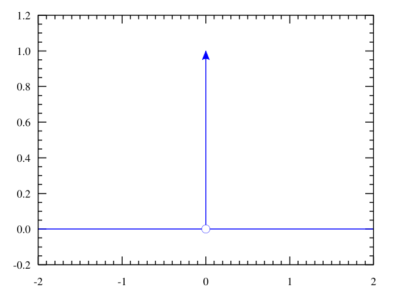

Prolific Dreamer 
:::

$$
\delta(x)=\begin{cases}0, &{x!=0} \\ \infty, &{x=0} \end{cases}
$$

$$
\int_{-\infty} ^\infty \delta(x) dx=1
$$

Sec 4는 text-to-3D 알고리즘의 orthogonal 요소들에 대한 추가적인 **systematically study**와 clear **design space**를 담고 있다. 특히 훈련과정 중 고화질 렌더링과 시각적 품질 개선을 위한 **annealed distilling time schedule**을 제안한다. 또한 복잡한 scene을 표현하기 위한 s**cene initialization**을 제안한다. 요소들에 대한 ablation study는 Sec 5에서 볼 수 있으며, 앞서 언급한 요소들은 VSD에 효과적임을 보인다. 결론적으로 high-fidelity, diverse 3D 결과를 얻을 수있으며 이를 **ProlificDreamer**라고 한다.

Sec 5에서 ProlificDreamer의 고화질(512x512) rendering 능력과 rich structure와 complex effects를 Neural Radiance Fields(NeRF)상에서 표현할 수 있음을 보인다. ProlificDreamer는 다중 물체가 포함된 복잡한 scene의 360도 전방향을 성공적으로 표현하는 것에 처음으로 성공했다. 게다가 NeRF로 초기화 한 후 ProlificDreamer로 세세하고 photorealistic한 3D texture mesh들을 생성할 수있다.

:::{figure-md}
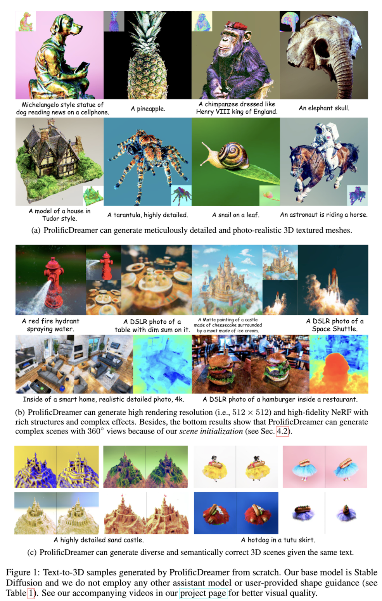

Prolific Dreamer  생성 결과
:::

## 2. Background

### Diffusion models (DMs)

**Score-Based Generative Modeling through Stochastic Differential Equations**

- **forward process** $\{q_t\}_{t\in[0,1]}$ - gradually add noise to a data point $x_0\sim p_0(x_0)$
    
    $$
    q_t(x_t|x_0):=\mathcal N(\alpha_tx_0,\sigma_t^2 I)\\q_t(x_t):=\int q_t(x_t|x_0)q_0(x_0) dx_0
    $$
    
    $\alpha_t, \sigma_t >0$ 는 hyperparameter로 $\alpha_0\approx 1,\sigma_0\approx 0,\alpha_1\approx 0, \sigma_t\approx 1$ 이다.
    
- **reverse process** $p_t$ - denoising from $p_1(x_1):=\mathcal N(0,I)$ by predicting the noise added to a clean data $x_0$
    
    noise prediction network $\epsilon_\phi(x_t,t)$을 학습하는 과정은 아래와 같다.
    
    $$
    \mathcal L_\text{Diff}(\phi):=\Bbb E_{x_0\sim q_0(x_0),t\sim\mathcal U(0,1),\epsilon \sim \mathcal N(o,I)}\Big[ \omega(t)\|\epsilon_\phi(\alpha_t x_0+\sigma_t\epsilon)-\epsilon\|_2^2\Big], \tag 1
    $$
    
    $\omega(t)$는 time dependent weighting function이다. 훈련이 끝나면 $p_t\approx q_t$ 가 되며 따라서 $p_0\approx q_0$ 으로 sample들을 그릴 수 있게 된다. 덧붙여 noise prediction network는 $p_t, q_t$ 의 score function을 approximating하는 데에도 사용가능하다. $\triangledown_{x_t}\text{log}q_t(x_t)\approx\triangledown_{x_t}\text{log}p_t(x_t)\approx-\epsilon_\phi(x_t,t)/\sigma_t$
    

diffusion model이 가장 활발히 활용되고 있는 분야 중 하나는 text-to-image generation으로 text prompt $y$를 조건으로 noise를 예측한다. 또한 Classifier-free Guidence를 통해 샘플 품질과 다양성을 조절한다. guidance scale이 커질 수록 품질이 올라가지만 다양성이 감소하는 경향을 보인다.

### Text-to-3D by score distillation sampling

- **Score Distillation Sampling (SDS)** from DreamFusion
- **Score Jacobian Chaining (SJC)** 라고도 불리며 Zero-1-to-3, Magic3d, Fantasia3d, Latent NeRF 등 다양한 연구에 활용되고 있다.

사전학습된 T2I diffusion model $p_t(x_t|y)$과 noise prediction network $\epsilon_\text{pretrained}(x_t,t,y)$ 을 이용해 SDS는 single 3D representation의 parameter $\theta \in \Theta$를 최적화 한다. 이때 사용하는 metric은 **Euclidean metric**으로 $\Theta$는 Euclidean space이다.

camera parameter $c$가 분포 $p(c)$를 따르고, 
differentiable rendering mapping $g(\cdot,c):\Theta \rightarrow \Bbb R^d$ 이 주어진다고 하자. 
$y^c$를 view dependent prompt라고 하면, rendering image $g(\theta,c)$에서 시작하는 forward diffusion process는 $q_t^\theta(x_t|c)$로 표현할 수 있다. 

SDS는 parameter $\theta$를 아래와 같이 최적화한다.

$$
\mathcal L_{\text{SDS}}(\theta):=\Bbb E_{t,c}\Big [\frac{\sigma_t}{\alpha_t}\space\omega(t)\space D_\text{KL}(q_t^\theta(x_t|c)\|p_t(x_t|y^c)\Big] \tag{2}
$$

$$
\mathcal L_{\text{SDS}}(\theta)\approx\Bbb E_{t,\epsilon,c}\Big [\omega(t)\space \big(\epsilon_\text{pretrained}(x_t,t,y^c)-\epsilon\big)\frac{\partial g(\theta,c)}{\partial\theta}\Big] \tag{3}
$$

### 3D representations

- **NeRF** → MLP
    - multilayer perceptron을 이용해 3D 객체를 표현한다. 3차원 공간상의 위치 정보를 입력하면 해당하는 색과 밀도를 얻을 수 있다. 이때 $\theta$는 MLP의 내부 파라미터를 의미한다.
    - 카메라 위치 $c$가 주어질때, rendering process $g(\theta,c)$는 casting rays로 정의되며 각 ray의 sampling points의 색을 가중합하여 각 픽셀의 값을 결정한다.
    - NeRF는 최적화 측면에서 유연하고 복잡한 장면도 표현가능하다. (매우 상대적인 표현으로 사료됨.)
- **Textured mesh** → triangle mesh + texture
    - triangle mesh와 해당 mesh 표면의 texture, color로 3D 객체를 표현한다. 여기서 3D parameter $\theta$는 triangle meshes의 좌표와 texture parameter를 의미한다.
    - 카메라 위치 $c$가 주어질때, rendering process $g(\theta,c)$는 casting rays로 정의되며 각 ray가 지나는 mesh의 intersection의 색을 계산함으로써 각 픽셀의 값을 결정한다.
    - Textured mesh는 고화질 렌더링이 가능하고 differentiable rasterization을 이용하면 렌더링 속도가 빠르다.

## 3. Variational Score Distillation

:::{figure-md}


Prolific Dreamer 
:::

### 3.1 Sampling from 3D Distribution via Variational Inference

3D represetation에 사용되는 parameter $\theta$들은 확률밀도 $\mu(\theta|y)$로 모델링 할 수 있다.
$q_0^\mu(x_0|c,y)$는 rendered image $x_0;=g(\theta,c)$의 분포, $p_0(x_0|y^c)$는 $t=0$ 일때 marginal distribution이다. 

고품질의 3D representation을 얻기 위해서 distribution $\mu$를 최적화 하는 방법을 제안한다. 사전학습된 DM을 이용해 모든 view에 대한 rendered image sample과 distribution $\mu$를 정렬(align)하는 것은 아래와 같이 두 분포의 거리를 좁히는 것이라고 할 수 있다. 

$$
\text{min}_\mu D_\text{KL}\big(q_0^\mu(x_0|c,y)\|p_0(x_0|y^c)\big) \tag{4}
$$

- SDS eq.2
    
    $$
    \mathcal L_{\text{SDS}}(\theta):=\Bbb E_{t,c}\Big [({\sigma_t}/{\alpha_t})\space\omega(t)\space D_\text{KL}(q_t^\theta(x_t|c)\|p_t(x_t|y^c)\Big] \tag{2}
    $$
    

위의 식은 일반적인 variational inference problem으로 variational distribution $q_0^\mu(x_0|c,y)$을 target distribution $p_0(x_0|y^c)$으로 근사(distill)하는 방식을 사용한다.

위의 식 4의 prob을 직접 푸는것은 복잡하고 비효율적이기 때문에 diffusion model을 이용해 series of optimization problem을 통해 해결하고자 한다. $t$가 $T$를 향해 점점 커질때, 위의 최적화 문제는 diffused distribution이 gaussian distribution에 가까워 지며 점점 쉬워진다.

(기존 SDS 최적화 식의 parameter $\theta$가 distribution $\mu$로 바뀐 형태)

$$
\mu^*:=\text{argmin}_\mu\Bbb E_{t,c}\Big[ (\sigma_t/\alpha_t)\omega(t)D_{KL}(q_t^\mu(x_t|c,y)\|p_t(x_t|y^c))\Big] \tag5
$$

- SDS eq.2
    
    $$
    \mathcal L_{\text{SDS}}(\theta):=\Bbb E_{t,c}\Big [({\sigma_t}/{\alpha_t})\space\omega(t)\space D_\text{KL}(q_t^\theta(x_t|c)\|p_t(x_t|y^c)\Big] \tag{2}
    $$
    

### 3.2 Update Rule for Variational Score Distillation

식 5의 prob을 풀기위해 또 다른 생성모델을 훈련하여 풀 수 있는데 이는 resource가 많이 필요하고 최적화 과정이 복잡해진다. 앞선 particle-based variational inference 연구와 유사하게,  n개의 3D particles를 유지하고 해당 particles을 위한 새로운 update rule을 제안한다. 즉, $\{\theta\}^n_{i=1}$을 현재 distribution $\mu$를 표현하기 위해 사용하는 것이다. $\theta^{(i)}$는 최적화 과정이 수렴되고 하면 최적 분포 $\mu^*$에서 샘플링된 것이 된다. 

$$
\frac{d\theta_\tau}{d\tau}=-\Bbb E_{t,\epsilon,c}\Big[\omega(t)\big(-\sigma_t\triangledown_{x_t} \text{log}p_t(x_t|y^c)-(-\sigma_t\triangledown_{x_t}\text{log}q_t^{\mu_\tau}(x_t|c,y))\big)\frac{\partial g(\theta_\tau,c)}{\partial\theta_\tau} \tag 7
$$

$$
\text{min}_{\phi}\sum^n_{i=1}\Bbb E_{t\sim\mathcal U(0,1),\epsilon\sim\mathcal N(o,I),c\sim p(c)}\Big[\|\epsilon_\phi(\alpha_tg(\theta^{(i)}),c)+\sigma_t\epsilon,t,c,y)-\epsilon\|^2_2\Big] \tag 8
$$

최종적으로는 아래와 같은 objective function을 얻는다.

$$
\triangledown_\theta\mathcal L_{VSD}(\theta)\triangleq\Bbb E_{t,\epsilon,c}\Big[\omega(t
)(\epsilon_{\text{pretrain}}(x_t,t,y^c)-\epsilon_\phi(x_t,t,c,y))\frac{\partial g(\theta,c)}{\partial\theta}\Big]\tag {9}
$$

:::{figure-md}


Prolific Dreamer 
:::

### 3.3 Comparison with SDS

**SDS as a special case of VSD**

$$
\mathcal L_{\text{SDS}}(\theta)\approx\Bbb E_{t,\epsilon,c}\Big [\omega(t)\space \big(\epsilon_\text{pretrained}(x_t,t,y^c)-\epsilon\big)\frac{\partial g(\theta,c)}{\partial\theta}\Big] \tag{SDS}
$$

$$
\triangledown_\theta\mathcal L_{VSD}(\theta)\triangleq\Bbb E_{t,\epsilon,c}\Big[\omega(t
)(\epsilon_{\text{pretrain}}(x_t,t,y^c)-\epsilon_\phi(x_t,t,c,y))\frac{\partial g(\theta,c)}{\partial\theta}\Big]\tag {VSD}
$$

SDS는 $\mu(\theta|y)\approx \delta(\theta-\theta^{(1)})$ 인 VSD의 special case에 해당한다. VSD는 potential mutliple particles일 뿐 아니라 parametric score function $\epsilon_\phi$도 학습하기 때문에 SDS와 동일하게 single particle을 사용해도 성능이 좋다. 또한 LoRA를 사용해 text prompt 로 부터 추가적으로 뽑아낸 정보를 estimation $\epsilon_\phi(x_t,t,c,y)$에 반영할 수 있다.
    
:::{figure-md}
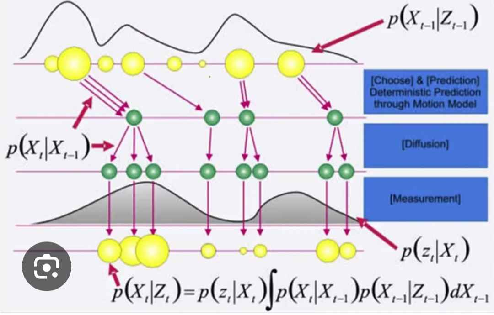

particle이 뭘까? 느낌적인 느낌을 받아보자.
:::
    

**VSD is friendly to CFG**

VSD는 사전학습된 diffusion model을 이용해 optimal $\mu^*$에서 sample $\theta$를 추출하고자 한다. 때문에 3D sampling에서 CFG를 tuning한 효과가 기존 2D이미지 생성시 DPM-solver에서 CFG 값을 조절하는 것과 유사하다. 그래서 CFG 값을 조절하면서 더 다양한 실험결과를 얻을 수 있게 된다. SDS도 이점은 마찬가지 이나, CFG 값이 클때만 유효한 3D content를 만들어 낼 수 있었다.

**VSD vs. SDS in 2D experiments that isolate 3D representations**

동일한 rendering 모델을 이용해 VSD와 SDS의 3D 표현력만 비교한 결과이다. 

:::{figure-md}
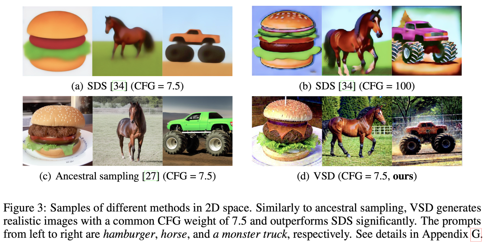

particle이 뭘까? 느낌적인 느낌을 받아보자.
:::

<details>
<summary>Appendix의 실험결과</summary>
    
:::{figure-md}
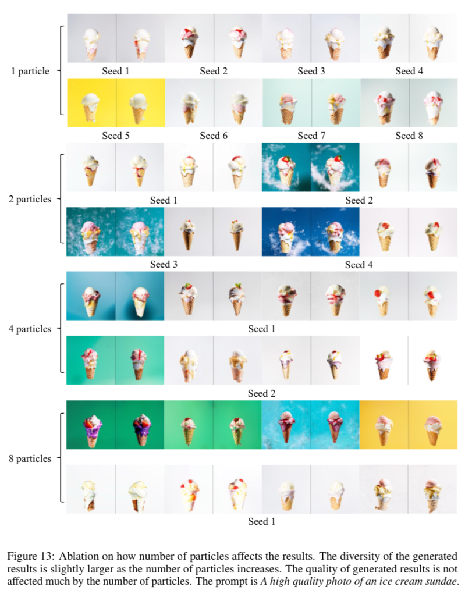

particle 개수에 따른 생성 퀄리티 비교 (single particle을 사용할 때도 SDS보다 성능이 좋다고 함)
:::

:::{figure-md}
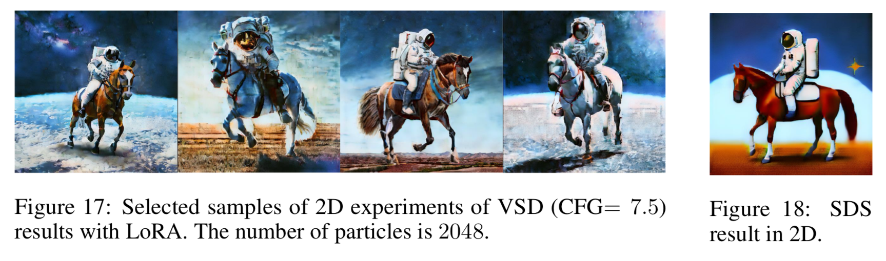

2D 이미지 생성으로 비교한 VSD와 SDS의 생성 품질  차이 / SDS는 VSD에 비해 부드럽고 세부표현이 부족하다.
:::


:::{figure-md}
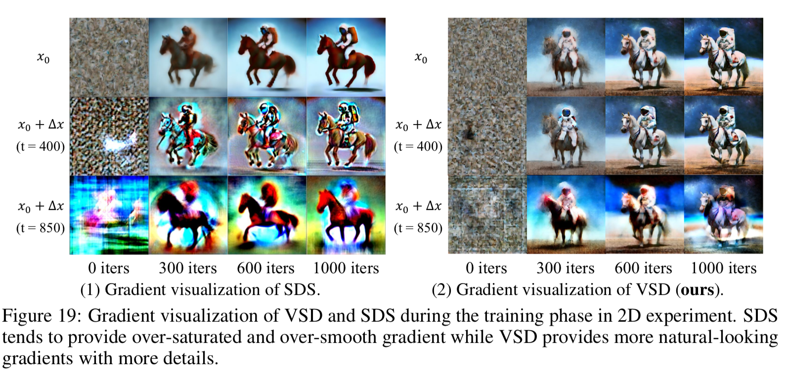

gradient visualization에서도 SDS와 VSD의 차이점을 확인 할 수 있다.
:::
</details>

## 4. Prolific Dreamer

### 4.1 Design Space of Text-to-3D Generation

**two-stage approch**를 이용해 text-to-3D 생성의 design space를 개선하고자 했다.

1. **First Stage** - optimize a high-resolution NeRF by VSD
2. **Second Stage** - DMTet to extract textured mesh from NeRF

:::{figure-md}
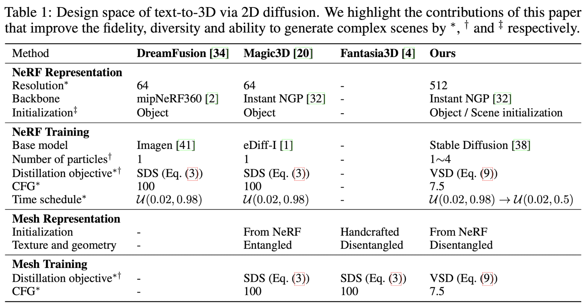

Prolific Dreamer와 다른 모델의 특성 비교
:::

### 4.2 3D Representation and Training

:::{figure-md}
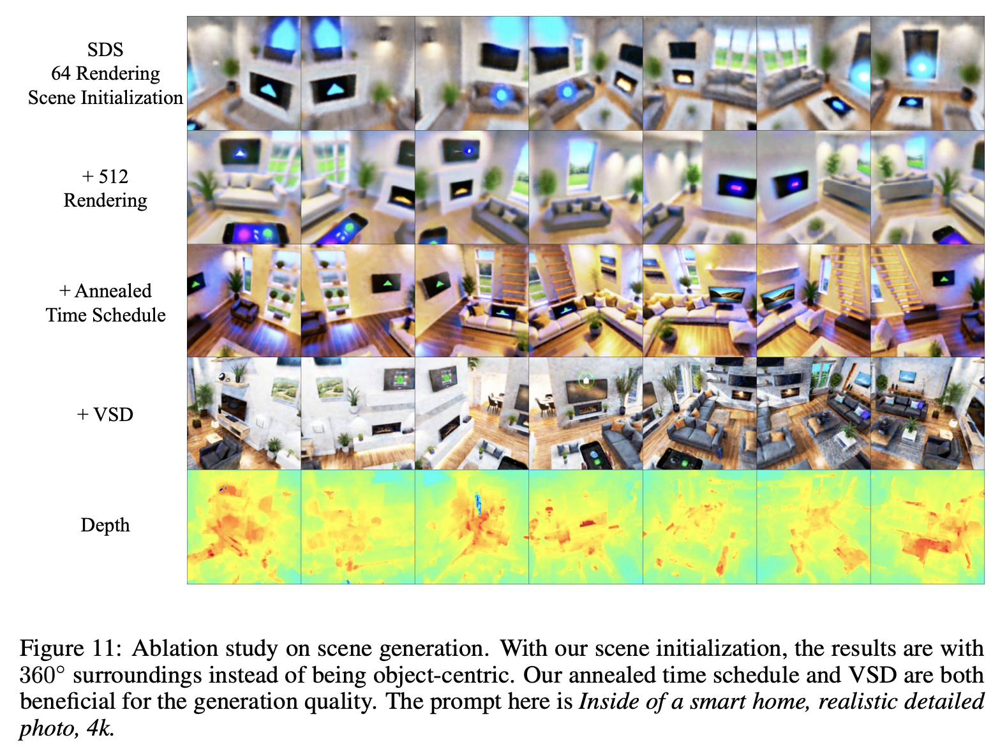

Prolific Dreamer 수행 결과
:::

**High-resolution rendering for NeRF training** (in 1st stage)

ProlificDreamer에서는 고화질 렌더링을 위해 **Instant NGP**를 사용했으며 VSD를 이용해 512 resolution 까지 NeRF를 최적화 했다. VSD를 사용함으로써 high-fidelity 결과를 얻을 수 있었다.

- Instant NGP

**Scene initialization for NeRF training** (in 1st stage)

NeRF의 초기 density는 $\sigma_\text{init}(\mu)=\lambda_\sigma(1-\frac{\|\mu\|_2}{r})$로 초기화 한다. $\lambda$ 는 density strength, $r$ 는 density radius, $\mu$는 3d coordinate이다. 

object-centric scene에서는 Magic3D의 방식을 따랐으며($\lambda=10, r=0.5$), 
복잡한 scene의 경우  $\lambda=-10$ 로 하여 density가 거의 비어있도록 하고, $r$을 2.5로 하여 camera를 둘러 싸도록 했다.

**Annealed time schedule for score distillation** (in 1st stage)

단순한 2단계 annealing을 score distillation objective에 적용했다. 이는 SDS나 VSD 모두에 적용가능하다. 초기 몇 스텝에서는 $t\sim \mathcal U(0.02,0.98)$로 하고 이후에는 $t\sim \mathcal U(0.02,0.50)$로 설정했다.

여기서 핵심은 $q_0^\mu(x_0|c,y)$와 $p_0(x_0|y^c)$를 맞추는 것인데 t가 커지면 KL divergence가 학습초기에 더 적당한 최적화 방향으로 갈 수 있다. t가 작으면 더 세부적인 조정이 가능하므로 $p_t(x^*|y^c)$와  $p_0(x^*|y^C)$의 차를 더 줄일 수 있다.

**Mesh representation and fine-tuning** (in 2nd stage)

coordinate-based hash grid encoder의 특성을 이용해 NeRF에서 mesh를 추출했다. Fantasia3D의 방법론을 따랐는데 여기서는 geometry와 texture를 분리하여 최적화했다. 첫번째로는 normal map을 이용해 geometry를 최적화하고 두번째로 texture를 최적화하는 식이다. 실험결과에서 이단계에서는 SDS와 VSD의 품질 차이가 크지않아 효율성을 위해 SDS를 사용했다. 하지만 Fantasia3D와 비교했을때 VSD 및 앞선 방법론을 이용해 최적화한 NeRF에서 뽑아낸 mesh는 SDS를 이용한 것보다 뛰어났다.

## 5. Experiments

### 5.1 Results of Prolific Dreamer

<details>
<summary>Appendix의 실험결과</summary>
    
:::{figure-md}


particle 개수에 따른 생성 퀄리티 비교 (single particle을 사용할 때도 SDS보다 성능이 좋다고 함)
:::

:::{figure-md}


2D 이미지 생성으로 비교한 VSD와 SDS의 생성 품질  차이 / SDS는 VSD에 비해 부드럽고 세부표현이 부족하다.
:::


:::{figure-md}


gradient visualization에서도 SDS와 VSD의 차이점을 확인 할 수 있다.
:::
</details>
    

### 5.2 Ablation Study

**Ablation on NeRF Training**

64x64 rendering + SDS에서 시작하여 요소들을 추가하며 실험한 결과는 아래와 같다. 
:::{figure-md}
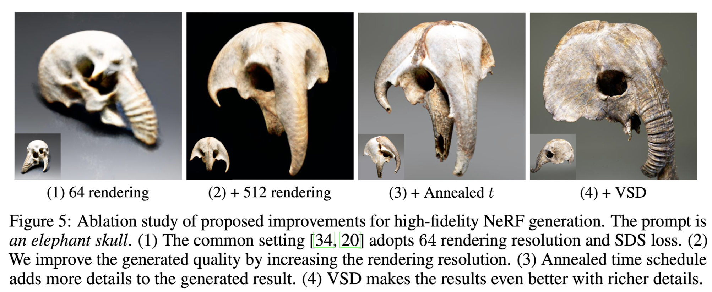

Prolific Dreamer 실험 결과
:::

**Ablation on mesh fine-tuning**

:::{figure-md}


Prolific Dreamer 실험 결과
:::

**Ablation on CFG**

CFG 값이 작으면 diversity 상승, CFG 값이 크면 비교적 diversity가 하락하는 실험결과를 얻음. VSD의 경우 CFG 값이 작을때에도 좋은 품질의 3D content를 생성할 수있기 때문에 충분한 diversity의 결과를 얻을 수 있지만 SDS의 경우 CFG 값이 커야만 괜찮은 3D content를 생성하기 때문에 diversity가 하락할 수밖에 없음.

:::{figure-md}
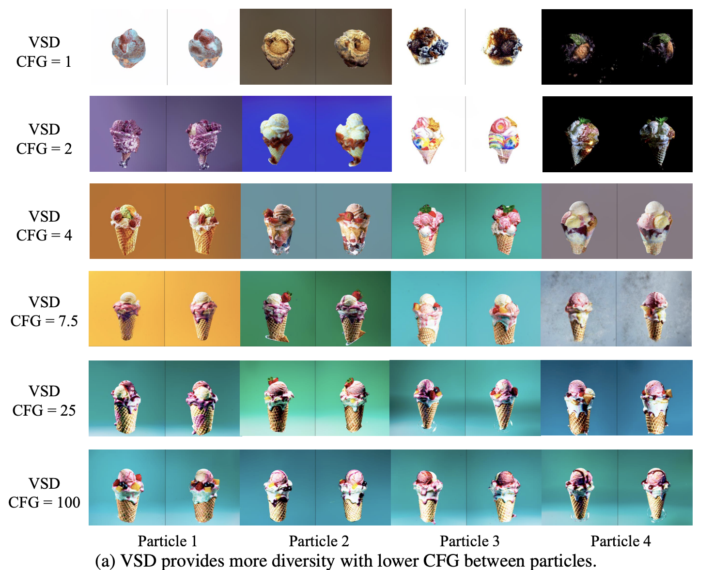

Prolific Dreamer 실험 결과
:::

:::{figure-md}
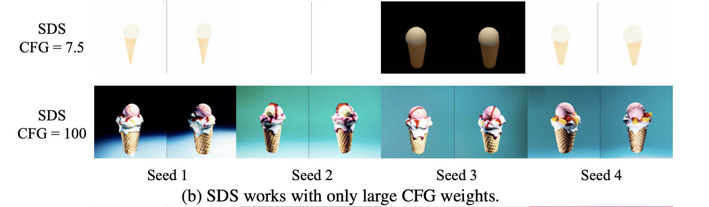

Prolific Dreamer 실험 결과
:::

:::{figure-md}
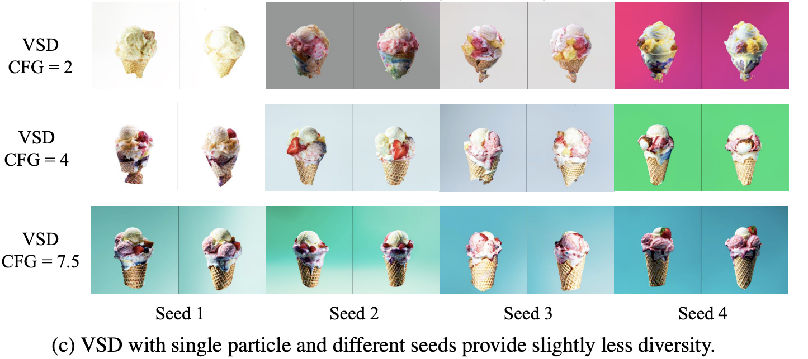

Prolific Dreamer 실험 결과
:::


    📌개인적 감상

    GAN : WGAN = DreamFusion : ProlificDreamer

    GAN : Diffusion = DreamFusion : ProlificDreamer


## Future Work

- GECO
    - 고정된 수의 particle을 이용하는 prolific dreamer의 단점을 보완해 새로운 샘플을 생성할 수 있도록 함.