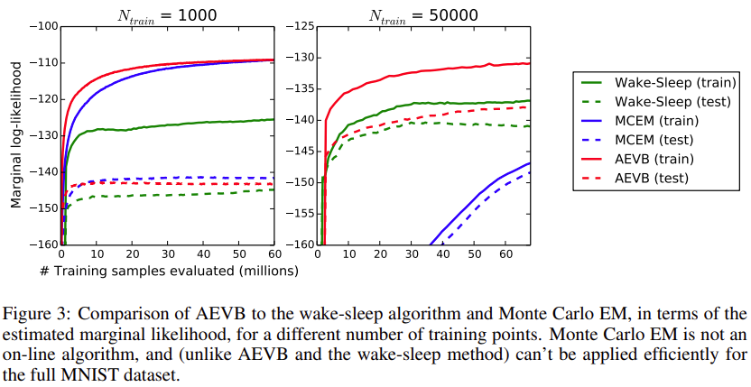

```{admonition} Information
- **Title:** Auto-Encoding Variational Bayes (ICLR 2014)

- **Reference**
    - Paper: [https://arxiv.org/abs/1312.6114](https://arxiv.org/abs/1312.6114)
    - Code: [https://github.com/GunhoChoi/PyTorch-FastCampus](https://github.com/GunhoChoi/PyTorch-FastCampus)
    - [Smart Design Lab @KAIST | 딥러닝 Ch.3.3 VAE](https://www.youtube.com/watch?v=GbCAwVVKaHY&t=95s)

- **Author:** Sangwoo Jo

- **Last updated on Apr. 12, 2023**
```
 
# VAE


## Introduction

논문의 Introduction 에 다음과 같은 문구가 적혀있는데요.  

> "Variational Bayesian (VB) approach involves the optimization of an approximation to the intractable posterior”
> 

이처럼 Variational Autoencoder 는 논문에서 제시하는 Auto-Encoding Variational Bayes(AEVB) 알고리즘 중 하나로, intractable 한 posterior 분포를 다루기 쉬운 뉴럴 네트워크로 근사함으로써 Variational Inference 를 하게 됩니다. 

이가 의미하는 바가 무엇인지 한번 살펴보도록 하겠습니다. 

## Intractability

Variational Autoencoder(VAE) 는 크게 Encoder 와 Decoder 부분으로 이루어져 있습니다. 더 자세하게는, Encoder는 입력 데이터 $x$ 를 받아서 잠재변수(Latent Variable) $z$ 를 만들어내고, Decoder 는 잠재변수 $z$ 를 활용해서 다시 $x$ 를 복원하게 됩니다.  

:::{figure-md} 


Variational Autoencoder(VAE) Architecture 
:::

Variational Autoencoder (VAE) 는 AutoEncoder 와 달리 확률 분포를 이용해 어떤 새로운 데이터를 생성하는 Decoder 부분에 초점을 둡니다. 이때 논문에서 다음과 같은 assumption 들을 내립니다. 첫번째로 $p_{\theta}(z)$ 와 $p_{\theta}(x|z)$ 는 parametric 한 distribution 을 가지고 있고, 이는 $\theta$ 와 $z$ 에 대해 differentiable 하다는 가정을 내립니다. 이 때, 대표적으로 $p_{\theta}(z)$ 는 Gaussian distribution 을 따르고 $p_{\theta}(x|z)$ 는 생성하고자 하는 데이터 성질에 따라 Bernoulli 혹은 Gaussian distribution 을 따르도록 정의합니다. 그리고 $p_{\theta}(x|z)$ 의 파라미터 $p$ 혹은 $(\mu, \sigma)$ 는 아래 그림과 같이 뉴럴 네트워크로 구성된 Decoder 로부터 계산이 됩니다. 

:::{figure-md} 


Overview of Bernoulli(left) and Gaussian(right) Decoder
:::

이를 기반으로 우리는 ML/MAP estimation 을 통해 marginal likelihood $p_{\theta}(x)$ 를 최대화시키는 파라미터 $\theta$ 를 구하는 것이 목적입니다. 하지만, $p_{\theta}(x) = \int p_{\theta}(z)p_{\theta}(x|z) \ dz$  는 intractable 하기 때문에 $p_{\theta}(z|x)$ 를 계산하기 위한 Encoder 가 등장하게 됩니다. 

$$
p_{\theta}(x) = p_{\theta}(x|z)p_{\theta}(z)/p_{\theta}(z|x)
$$

여기서 $p_{\theta}(z|x)$ 역시 intractable 하기 때문에 이를 잘 근사화하는 뉴럴 네트워크 $q_{\phi}(z|x)$ 를 정의하게 되고, 이러한 과정을 변분추론(Variational Inference) 라고 합니다. 아래는 Encoder 와 Decoder 를 함께 도식화한 그림입니다. 정리하자면, MLP Encoder 를 통해 계산된 $\mu$ 와 $\sigma$ 로 잠재변수 $z$ 를 생성하게 되고, 이를 기반으로 Decoder 는 원본 이미지와 유사한 데이터를 생성하게 됩니다.  

:::{figure-md} 


Overview of Gaussian Encoder and Decoder 
:::

해당 implementation code 도 확인해보겠습니다. 

- **Encoder 구현 code**
    
    ```python
    
    class Encoder(nn.Module):
        def __init__(self):
            super(Encoder,self).__init__()
            self.fc1_1 = nn.Linear(784, hidden_size)
            self.fc1_2 = nn.Linear(784, hidden_size)
            self.relu = nn.ReLU()
                            
        def encode(self,x):
            x = x.view(batch_size,-1)
            mu = self.relu(self.fc1_1(x))
            log_var = self.relu(self.fc1_2(x))
                    
            return mu,log_var
        
        def reparametrize(self, mu, logvar):
            std = logvar.mul(0.5).exp_()
            
            eps = torch.FloatTensor(std.size()).normal_()
            eps = Variable(eps).cuda()
            
            return eps.mul(std).add_(mu)
        
        def forward(self,x):
            mu, logvar = self.encode(x)
            reparam = self.reparametrize(mu,logvar)
            
            return mu,logvar,reparam
    ```
    
- **Decoder 구현 code**
    
    ```python
    class Decoder(nn.Module):
        def __init__(self):
            super(Decoder,self).__init__()
            self.fc1 = nn.Linear(hidden_size, 784)
            self.sigmoid = nn.Sigmoid()
        
        def forward(self,x):
            out = self.fc1(x)
            out = self.sigmoid(out)
            out = out.view(batch_size,28,28,1)
            
            return out
    ```
    

이로써 우리는 marginal likelihood $p_{\theta}(x)$ 를 최대화시키는 파라미터 $(\theta, \phi)$ 를 찾으면 되고, 수식적으로 표현하면 손실함수(loss function) 를 다음과 같이 Reconstruction Error 와 Regularization term 로 분할할 수 있습니다. 

$$
L(\theta, \phi;x_i) = \arg \min_{\theta, \phi} \sum_{i} -\mathbb{E}\_{q_{\phi}(z|x_i)}[log(p(x_i|g_{\theta}(z))] + KL(q_{\phi}(z|x_i)||p(z))
$$

Reconstruction Error 는 Decoder 에서 생성하는 데이터가 최대한 원본 데이터와 유사하도록 하는 term 이고, Regularization 은 Encoder 에서 만드는 잠재변수의 분포가 저희가 부여한 prior distribution 이랑 가깝도록 설정하는 term 입니다. 이때, Reconstruction Error 는 Monte Carlo 기법으로 근사값을 구할 수 있고, 하나의 sample 을 계산하는 것도 연산량이 많으므로 논문에서는 sample size $L$ 을 1 로 설정합니다. 

$$
\mathbb{E}\_{q_{\phi}(z|x_i)}[log(p(x_i|g_{\theta}(z))] = \int log(p_{\theta}(x_i|z))q_{\phi}(z|x_i)dz \approx \frac{1}{L}\sum_{z^{i,l}} log(p_{\theta}(x_i|z^{i,l}))
$$

## Reparameterization Trick

backpropagation을 사용하여 모델 학습을 원활히 할 수 있도록 Reparameterization Trick을 사용합니다. 잠재변수 $z$ 를 Encoder 에서 나온 $\mu$ 와 $\sigma$ 로 직접 샘플링하지 않고, backpropagation 이 가능하도록 Gaussian noise 를 우선적으로 샘플링하고 해당 $\mu$ 와 $\sigma$ 를 각각 더하고 곱하게 됩니다. 이는 $q_{\phi}(z|x)$ 이 Gaussian distribution 을 따른다고 설정했을 때이고, $q_{\phi}(z|x)$ 에 대해 다른 분포를 가정할 때 그리고 그에 따른 다른 reparameterization trick 을 시도할 수 있다고 논문에 명시되어 있습니다. 

아래 그림은 Gaussian 분포에 대한 Reparameterization Trick입니다. 그림에서 왼쪽은 Trick이 적용되지 않은 경우로 $\mu$나 $\sigma$ 값이 고정되어 있어도 $\mathcal{N}(\mu,\sigma)$에서 샘플링하므로 $z$는 랜덤한 값이며, 식에서 $\mu$나 $\sigma$를 미분할 수 없어 backpropagation이 어렵습니다. 반면 오른쪽은 $z=...$과 같은 deterministic한 형태로 되어 있고 $\mu$나 $\sigma$로 식을 미분할 수 있어 backpropagation을 통해 쉽게 학습 시킬 수 있습니다.

:::{figure-md} 


Overview of Reparameterization Trick
:::


## SGVB(Stochastic Gradient Variational Bayes)

위에서 구한 Reparameterization Trick를 활용하고 Loss 함수를 변형하여 Stochastic Gradient를 적용하여 최적화를 효율적으로 수행할 수 있는 형태로 변환합니다. 논문에서는 2가지를 제시하고 있는데 1번째는 lower bound 전체에 대해 Monte Carlo를 적용한 방법입니다.

$$ \tilde{\mathcal{L}}^{A}(\theta,\phi;x^{(i)})=\frac{1}{L}\sum^{L}\_{l=1}\log p_{\theta}(x^{(i)},z^{(i,l)})-\log q_{\phi}(z^{(i,l)}|x^{(i)}) $$

2번째 식은 위에서 본 Reconstruction Error에 Monte Carlo 기법을 적용한 방법입니다. Lower bound를 다르게 표현하면 KL divergence와 기댓값으로 나뉠 수 있는데 기댓값에 대해서만 Monte Carlo를 적용한 것으로 식은 아래와 같이 변환됩니다. 논문에서는 위의 1번째 방법 대비 분산이 낮다고 이야기합니다. (2번째 방법이 식에서 기댓값에만 샘플링을 적용하여 분산이 더 낮은 것으로 생각됩니다.)

$$ \tilde{\mathcal{L}}^{B}(\theta, \phi; x^{(i)})=-D_{KL}(q_{\phi}(z|x^{(i)})||p_{\theta}(z))+\frac{1}{L}\sum^{L}_{l=1} \log p\_\theta  (x^{(i)}|z^{(i,l)})) $$ 

## Train Algorithm

위에서 만든 식을 바탕으로 모델 학습을 수행하며 학습 과정은 아래와 같습니다. 

:::{figure-md}

:::

Overview of Train Algorithm


- $\theta, \phi$ 파라미터 초기화
- repeat
    - $X^{M}$ : mini batch dataset
    - $\epsilon$ : noise distribution $p(\epsilon)$ 으로부터의 랜덤 샘플
    - g : $\nabla_{\theta,\phi}\tilde{L}(\theta, \phi;X^{M}, \epsilon)$
    - 위의 g(gradient)를 사용하여 $\theta, \phi$ update
- until : parameter $\theta, \phi$ 가 수렴할 때까지 진행
- return $\theta, \phi$


## Experiments
논문에서는 기존 방법과 제안한 알고리즘의 학습의 최적화 효율성을 비교하기 위해 MNIST와 Frey Face dataset에 대해 AEVB(Auto-Encoder variational Bayesian, AEVB에 Stochastic Gradient를 적용하면 SGVB가 됩니다)와 wake-sleep 알고리즘(비교대상으로 적절하다고 논문에서 언급됩니다)를 비교합니다. 여기서 Frey Face는 continuous하여 gaussian 분포로 식을 구성합니다. 결과는 아래 그림과 같습니다. 

:::{figure-md}

:::

위의 그림은 lower bound의 최적화를 비교한 것으로 제안하는 방법이 더 빠르게 수렴하며 모든 실험에서 더 나은 솔루션임을 볼 수 있습니다.

:::{figure-md}

:::

위의 그림은 estimated marginal likelihood를 Monte Carlo EM을 활용할 경우 최적화가 되는지 수행한 실험입니다. Monte Carlo EM의 경우 train 데이터가 많으면 수렴이 안되는 것을 볼 수 있습니다. 


## Summary

AutoEncoder 는 latent space 에 하나의 값으로 지정해줬다면, VAE 는 평균 그리고 분산 파라미터들과 Gaussian 분포를 가진 샘플을 통해 잠재변수를 생성합니다. 그리고 VAE 를 실제로 사용해보면 생성된 데이터 image quality 가 낮다는 단점을 가지고 있다고 합니다. 
